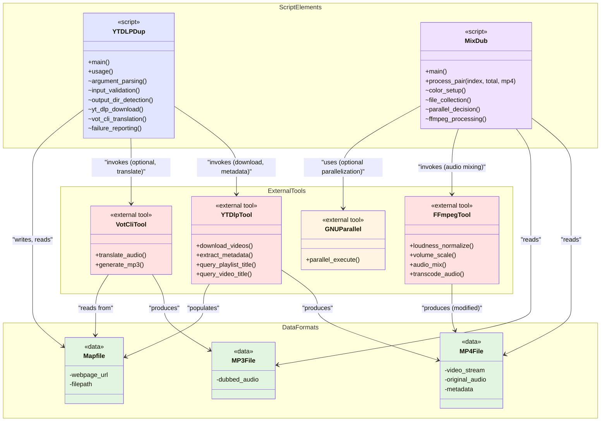

# C4 Code Level: Bash Examples / Workflow Scripts

## Overview

- **Name**: Bash Examples / Workflow Scripts
- **Description**: Reference implementations demonstrating the complete download, translate (dub), and mux workflow for the Video Download Manager with Optional Dubbing system
- **Location**: `../docs/examples/`
- **Language**: Bash (Shell scripting)
- **Purpose**: Provide executable examples of the intended end-to-end workflow: downloading videos from YouTube/playlists using yt-dlp, optionally translating audio using vot-cli, and mixing original and dubbed audio tracks using ffmpeg

## Code Elements

### Scripts

#### `yt_dlp_with_dup.sh` - Video Download and Translation Orchestrator
- **Type**: Main orchestration script
- **Location**: `../docs/examples/yt_dlp_with_dup.sh`
- **Description**: Orchestrates the download of videos (or playlists) from YouTube using yt-dlp and optionally runs vot-cli to translate/dub audio tracks into MP3 files. Handles both live execution and dry-run preview modes.

**Function Signature**:
```bash
yt_dlp_with_dup.sh [options] <video_or_playlist_url>
```

**Parameters and Options**:
- `<video_or_playlist_url>` (required): YouTube video or playlist URL to download
- `-o, --output-dir DIR` (optional): Output directory for downloaded files. If not specified, a directory is created with the playlist/video title
- `-t, --with-vot` (optional): Enable vot-cli translation for each video
- `-d, --dry-run` (optional): Preview mode - yt-dlp runs with `--skip-download`, vot-cli does not execute, only prints commands
- `-h, --help` (optional): Display usage information

**Key Functions/Sections**:

1. **`usage()`** (lines 5-15)
   - **Purpose**: Display command-line usage information
   - **Output**: Prints help text to stdout

2. **Argument Parsing** (lines 25-48)
   - **Purpose**: Parse and validate command-line arguments
   - **Variables Set**: `OUT_DIR`, `WITH_VOT`, `DRY_RUN`, `URL`
   - **Logic**: Uses `case` statement to handle options; supports long and short forms

3. **Input Validation** (lines 50-66)
   - **Purpose**: Validate that required URL is provided and external dependencies (yt-dlp, vot-cli) are available
   - **Dependencies Check**: Verifies `yt-dlp` is always available; conditionally checks `vot-cli` only if `--with-vot` flag is used and not in dry-run mode
   - **Exit Code**: Returns 1 if validation fails

4. **Output Directory Detection** (lines 71-95)
   - **Purpose**: Determine the output directory, either from user input or by auto-detecting playlist/video title
   - **Logic**:
     - If `--output-dir` not specified, queries yt-dlp for playlist title or video title
     - Sanitizes title by replacing `/` with `_`
     - Falls back to timestamped directory name if title detection fails
     - Creates directory structure unless in dry-run mode

5. **Temporary Mapfile Setup** (lines 100-101)
   - **Purpose**: Create temporary file to store URL-to-filepath mappings for cross-script reference
   - **Variables**: `MAPFILE` contains path to temporary file; cleanup trap registered on EXIT
   - **Format**: Each video pair occupies 2 lines - webpage_url, then filepath

6. **Step 1: yt-dlp Execution** (lines 106-126)
   - **Purpose**: Download videos (or metadata in dry-run mode)
   - **Dry-run Mode** (lines 109-117):
     - Runs with `--skip-download` flag
     - Collects video information and outputs webpage_url and filename to mapfile
     - Does not write video files
   - **Normal Mode** (lines 118-125):
     - Downloads videos with metadata embedded
     - Uses `--print-to-file` to append webpage_url and final filepath to mapfile
     - Respects `--yes-playlist` to handle playlist downloads
   - **yt-dlp Flags Used**:
     - `--merge-output-format mp4`: Output container format (mp4)
     - `--yes-playlist`: Process playlists (download all items)
     - `--embed-metadata`: Embed video metadata
     - `--skip-download`: (dry-run only) Skip actual video download
     - `-P`: Output directory
     - `--print` / `--print-to-file`: Metadata extraction for mapping

7. **Step 2: vot-cli Translation** (lines 132-191)
   - **Purpose**: Translate audio to dubbed MP3 files (if `--with-vot` flag set)
   - **Initialization** (lines 132-133):
     - Creates arrays `FAILED_URLS` and `FAILED_FILES` to track failed translations
   - **Conditional Execution** (lines 135-191):
     - Only runs if `WITH_VOT=1`
     - Skipped otherwise with message
   - **Processing Loop** (lines 140-186):
     - Reads mapfile 2 lines at a time (URL, filepath)
     - Counts total videos: `TOTAL=$(( $(wc -l < "$MAPFILE") / 2 ))`
     - For each video:
       - Extracts basename and generates MP3 filename (extension replacement)
       - Formats progress output with colored indicators
       - **In dry-run mode** (lines 174-176):
         - Prints vot-cli command that would be executed
         - Skips actual execution
       - **In normal mode** (lines 179-183):
         - Executes vot-cli with video URL
         - If vot-cli fails, records failure in arrays
   - **vot-cli Flags Used**:
     - `--output=DIR`: Output directory for MP3
     - `--output-file=FILENAME`: Specific MP3 filename
   - **Output Format**: Progress shown as `[translate] Translating item {N} of {TOTAL}`
   - **Error Handling**: Collects failures but continues processing remaining items

8. **Failure Reporting** (lines 197-212)
   - **Purpose**: Display summary of failed translations and recovery commands
   - **Logic**: Only displays if failures exist
   - **Output Format**: Lists failed files with their URLs and provides re-run commands for manual retry

**Global Variables**:
- `OUT_DIR`: Output directory path
- `WITH_VOT`: Boolean flag (0 or 1) to enable vot-cli
- `DRY_RUN`: Boolean flag (0 or 1) for preview-only mode
- `URL`: Target YouTube URL
- `MAPFILE`: Temporary file path for URL/filepath mappings
- `PLAYLIST_TITLE`, `TITLE`, `SAFE_TITLE`: Detected or sanitized directory names
- `TOTAL`, `CURRENT`: Counters for progress tracking
- `FAILED_URLS[]`, `FAILED_FILES[]`: Arrays tracking failed translations

**Error Handling**:
- Uses `set -euo pipefail` for strict error handling
- Validates all external dependencies before execution
- Continues processing on individual item failures but reports them
- Creates EXIT trap to clean up temporary mapfile

---

#### `mix_dub.sh` - Audio Track Mixing and Dubbing
- **Type**: Audio processing and muxing script
- **Location**: `../docs/examples/mix_dub.sh`
- **Description**: Processes pairs of MP4 video files with corresponding MP3 audio files (dubbed translations). Mixes the original audio track with the dubbed audio at appropriate volume levels, creating a single output MP4 with two audio tracks: the mixed dub+original track and the original audio track (normalized separately). Supports parallel processing via GNU parallel when available.

**Function Signature**:
```bash
mix_dub.sh
```

**Parameters**: None (operates on current directory's .mp4 and .mp3 files)

**Expected File Structure**:
- Current directory contains `.mp4` video files
- Each `.mp4` must have a corresponding `.mp3` file with the same basename
- Output files are written to `dup/` subdirectory as `{basename}.dup.mp4`

**Key Functions/Sections**:

1. **Color Definitions** (lines 5-12)
   - **Purpose**: Define ANSI color codes for terminal output
   - **Variables**: `NC` (no color), `GREEN`, `BRIGHT_GREEN`, `PURPLE`, `YELLOW`, `CYAN`, `RED`
   - **Usage**: Provides visual feedback during processing

2. **`process_pair()` Function** (lines 16-62)
   - **Type**: Exported function for use with GNU parallel
   - **Parameters**:
     - `$1` (index): Current item number (for progress display)
     - `$2` (total): Total number of items (for progress display)
     - `$3` (mp4): Path to MP4 video file
   - **Purpose**: Process a single video+audio pair, mixing tracks using ffmpeg

   **Sub-tasks**:

   a. **File Path Derivation** (lines 21-23)
      - Extracts base filename from `.mp4` path
      - Derives `.mp3` filename by replacing extension
      - Constructs output path: `dup/{base}.dup.mp4`

   b. **Output Existence Check** (lines 25-28)
      - Skips processing if output file already exists
      - Logs skip with `[skip]` status

   c. **Input Validation** (lines 30-33)
      - Verifies corresponding `.mp3` file exists
      - Skips processing if MP3 not found

   d. **ffmpeg Audio Mixing** (lines 37-55)
      - **Input Streams**:
        - `[0:a]`: Original audio from MP4
        - `[1:a]`: Dubbed audio from MP3
      - **Filter Complex Pipeline**:
        ```
        [0:a] → loudnorm (normalize) → volume=0.4 → [orig_quiet]
        [0:a] → loudnorm (normalize) → [orig_clean]
        [1:a] → loudnorm (normalize) → [dub_normed] → volume=1.0 → [dub_final]
        [orig_quiet] + [dub_final] → amix (mix 2 inputs) → [mixed]
        ```
      - **Loudnorm Settings**: `-I=-16` (loudness), `-TP=-1.5` (true peak), `-LRA=11` (loudness range)
      - **Volume Scaling**:
        - Original audio reduced to 0.4 (40%) before mixing
        - Dubbed audio at 1.0 (100%)
        - Amix normalizes combined levels
      - **Output Mapping**:
        - `0:v`: Video stream from original MP4 (no transcoding)
        - `[mixed]`: Mixed audio track (index 0 in output)
        - `[orig_clean]`: Original audio track (index 1 in output)
      - **Encoding**:
        - Video: Copy codec (no transcoding) `-c:v copy`
        - Audio: AAC `-c:a aac -b:a 192k` (192 kbps)
      - **Metadata Tags**:
        - Audio track 0: `"Dub Mix (Dub + Original)"`
        - Audio track 1: `"Original Audio (Normalized)"`

   e. **Status Reporting** (lines 57-61)
      - Logs success or error after ffmpeg completion
      - Displays progress as `[done]` or `[error]` with base filename

**Execution Flow** (lines 67-90):

1. **File Collection** (lines 68-72)
   - Globs for all `.mp4` files in current directory
   - Validates that at least one `.mp4` file exists
   - Exits with error if no files found

2. **Parallel vs Sequential Decision** (lines 78-88)
   - **Parallel Mode** (lines 78-80): If GNU `parallel` command available
     - Uses: `parallel process_pair {#} "$total" ::: "${files[@]}"`
     - `{#}` expands to job number (1-based index)
   - **Sequential Mode** (lines 82-87): Falls back to loop if GNU parallel not available
     - Manually iterates with index counter

3. **Progress Reporting** (lines 74-75, 90)
   - Displays file count before processing
   - Displays completion message after all items processed

**Global Variables**:
- `mp4`, `base`, `mp3`, `out`: File paths (local to function)
- `index`, `total`: Progress counters
- `GREEN`, `YELLOW`, `CYAN`, `PURPLE`, `BRIGHT_GREEN`, `RED`, `NC`: Color codes
- `files[]`: Array of discovered MP4 filenames

**Error Handling**:
- Uses `set -e` to exit on ffmpeg errors
- Skips already-processed files (idempotent)
- Skips when corresponding MP3 missing (graceful degradation)
- Continues with next file on individual processing errors

**External Function Dependency**:
- Exports `process_pair` function and all color variables for use by GNU parallel
- `export -f process_pair` allows function to be called in parallel jobs

---

## Dependencies

### Internal Dependencies

- **None**: These scripts are independent reference implementations and do not depend on other code in the repository

### External Dependencies

#### Required Tools:

1. **yt-dlp** (Python-based video downloader)
   - **Used by**: `yt_dlp_with_dup.sh`
   - **Functions**:
     - Discovers and downloads videos/playlists from YouTube and similar platforms
     - Extracts metadata (playlist title, video title, filename)
     - Embeds metadata in downloaded files
   - **Flags/Features Used**:
     - `--merge-output-format mp4`: Output container format specification
     - `--yes-playlist`: Process entire playlists
     - `--embed-metadata`: Embed video metadata
     - `--skip-download`: Metadata-only mode
     - `-P`: Output directory specification
     - `--print` / `--print-to-file`: Metadata extraction
   - **Installation**: `brew install yt-dlp` (macOS)

2. **vot-cli** (Video Translation CLI using yt-dlp and audio processing)
   - **Used by**: `yt_dlp_with_dup.sh` (conditional, with `--with-vot` flag)
   - **Functions**:
     - Translates/dubs audio from video sources to MP3 format
     - Leverages yt-dlp for audio extraction and speech-to-text/translation services
   - **Flags/Features Used**:
     - `--output=DIR`: Output directory for MP3 files
     - `--output-file=FILENAME`: Specific MP3 filename
   - **Invocation**: Called per video when dubbing enabled
   - **Error Handling**: Failures are caught and reported for manual retry

3. **ffmpeg** (Audio/video processing toolkit)
   - **Used by**: `mix_dub.sh`
   - **Functions**:
     - Audio normalization (loudness standardization)
     - Volume scaling
     - Audio track mixing (amix filter)
     - Video stream passthrough (copy codec)
     - Audio transcoding to AAC
     - Metadata tagging
   - **Filters Used**:
     - `loudnorm`: Loudness normalization with EBU R128 standard
     - `volume`: Scale audio level by factor
     - `amix`: Mix multiple audio streams
   - **Installation**: `brew install ffmpeg` (macOS)

#### Optional Tools:

1. **GNU parallel**
   - **Used by**: `mix_dub.sh`
   - **Functions**: Enables parallel processing of multiple video files
   - **Fallback**: Script gracefully handles absence by switching to sequential mode
   - **Installation**: `brew install parallel` (macOS)

### Data Dependencies

- **yt-dlp output format**: MP4 files with embedded metadata
- **vot-cli output format**: MP3 audio files
- **ffmpeg input**: MP4 video files + MP3 audio files with matching basenames
- **Mapfile format**: Newline-delimited pairs of (webpage_url, filepath)

---

## Relationships

### Workflow Relationships

```mermaid
%%{init: {'theme': 'base'}}%%
flowchart TD
    Start([User Invocation]) --> ParseArgs["Parse Arguments<br/>(URL, options)"]
    ParseArgs --> ValidateDeps["Validate Dependencies<br/>(yt-dlp, vot-cli)"]
    ValidateDeps --> DetectOut["Detect/Create Output Dir"]

    subgraph DOWNLOAD["Step 1: Download & Metadata"]
        CreateMap["Create Mapfile"]
        CreateMap --> YTDlp["Execute yt-dlp<br/>(download videos)"]
        YTDlp --> StoreMapping["Store URL↔Filepath<br/>in Mapfile"]
    end

    DetectOut --> DOWNLOAD

    subgraph DRY["Dry-Run Mode Check"]
        DRYDecide{Dry-Run<br/>Flag?}
        DRYDecide -->|Yes| PreviewVOT["Preview vot-cli<br/>commands"]
        DRYDecide -->|No| Continue["Continue to VOT"]
    end

    StoreMapping --> DRY

    subgraph TRANSLATE["Step 2: Translation/Dubbing (Optional)"]
        VOTEnable{VOT Enabled?}
        VOTEnable -->|No| SkipVOT["Skip Translation"]
        VOTEnable -->|Yes| ReadMap["Read Mapfile<br/>(URL ↔ Video pairs)"]
        ReadMap --> ForEachVideo["For Each Video in Mapfile"]
        ForEachVideo --> RunVOT["Execute vot-cli<br/>(translate to MP3)"]
        RunVOT --> CheckVOTStatus{Success?}
        CheckVOTStatus -->|No| RecordFailure["Record Failed URL<br/>and MP3 filename"]
        CheckVOTStatus -->|Yes| NextVideo["Next Video"]
        RecordFailure --> NextVideo
        NextVideo --> MoreVideos{More<br/>Videos?}
        MoreVideos -->|Yes| RunVOT
        MoreVideos -->|No| ReportFailures["Report Failures<br/>and Recovery Commands"]
    end

    Continue --> TRANSLATE
    PreviewVOT --> End1([Script Complete])
    SkipVOT --> VOTDone["Step 2 Skipped"]
    ReportFailures --> VOTDone

    VOTDone --> MixPhase["Now User Runs:<br/>mix_dub.sh"]

    subgraph MIX["Step 3: Mix Dub & Original Tracks"]
        FindFiles["Glob .mp4 files<br/>in current dir"]
        FindFiles --> ParallelCheck{GNU parallel<br/>available?}
        ParallelCheck -->|Yes| UseParallel["Use parallel for<br/>concurrent processing"]
        ParallelCheck -->|No| UseSeq["Use sequential loop"]

        UseParallel --> ProcessLoop["For Each MP4 File"]
        UseSeq --> ProcessLoop

        ProcessLoop --> CheckOutput{Output file<br/>exists?}
        CheckOutput -->|Yes| Skip["Skip (idempotent)"]
        CheckOutput -->|No| CheckMP3{Matching<br/>MP3 exists?}
        CheckMP3 -->|No| Skip2["Skip (no MP3)"]
        CheckMP3 -->|Yes| FFmpeg["Execute ffmpeg"]

        FFmpeg --> FilterPipeline["Filter Pipeline:<br/>Normalize → Volume → Mix"]
        FilterPipeline --> Encode["Encode:<br/>2 Audio Tracks<br/>+ Video"]
        Encode --> MixComplete["Output: .dup.mp4<br/>(mixed audio + original)"]

        Skip --> CheckMore{More<br/>Files?}
        Skip2 --> CheckMore
        MixComplete --> CheckMore
        CheckMore -->|Yes| ProcessLoop
        CheckMore -->|No| MixDone["All Files Processed"]
    end

    MixPhase --> MIX
    MixDone --> End2([Workflow Complete])

    style Start fill:#e1f5e1
    style End1 fill:#ffe1e1
    style End2 fill:#ffe1e1
    style DOWNLOAD fill:#e1e5ff
    style TRANSLATE fill:#fff4e1
    style MIX fill:#f0e1ff
    style DRY fill:#e1f5f5
```



### Script Invocation Sequence

```mermaid
sequenceDiagram
    participant User
    participant yt_dlp_with_dup.sh as yt-dlp-dup<br/>Script
    participant yt-dlp as yt-dlp Tool
    participant vot-cli as vot-cli Tool
    participant Filesystem as File System
    participant mix_dub.sh as mix-dub<br/>Script
    participant ffmpeg as ffmpeg Tool

    User->>yt_dlp_with_dup.sh: Run with URL, options
    yt_dlp_with_dup.sh->>yt_dlp_with_dup.sh: Parse arguments
    yt_dlp_with_dup.sh->>yt_dlp_with_dup.sh: Validate dependencies
    yt_dlp_with_dup.sh->>yt_dlp_with_dup.sh: Detect/create output dir

    yt_dlp_with_dup.sh->>yt-dlp: yt-dlp (download | metadata-only)
    yt-dlp->>Filesystem: Write video files (if not skip-download)
    yt-dlp->>yt_dlp_with_dup.sh: Return video metadata
    yt_dlp_with_dup.sh->>Filesystem: Store mappings to mapfile

    alt WITH_VOT enabled
        yt_dlp_with_dup.sh->>yt_dlp_with_dup.sh: Read mapfile (URL ↔ files)
        loop For each video
            yt_dlp_with_dup.sh->>vot-cli: vot-cli (translate video to MP3)
            vot-cli->>Filesystem: Write MP3 file
            vot-cli->>yt_dlp_with_dup.sh: Return status (success/failure)
            alt Translation failed
                yt_dlp_with_dup.sh->>yt_dlp_with_dup.sh: Record failure
            end
        end
        yt_dlp_with_dup.sh->>User: Report failures and recovery commands
    else WITH_VOT disabled
        yt_dlp_with_dup.sh->>User: Skip Step 2
    end

    yt_dlp_with_dup.sh->>Filesystem: Cleanup mapfile
    yt_dlp_with_dup.sh->>User: Script complete

    note over User: User navigates to output directory
    User->>mix_dub.sh: Run in directory with .mp4 + .mp3 files

    mix_dub.sh->>Filesystem: Glob .mp4 files
    mix_dub.sh->>mix_dub.sh: Detect parallel support

    par Parallel processing (if available)
        loop For each .mp4 file (concurrent)
            mix_dub.sh->>mix_dub.sh: process_pair() function
            mix_dub.sh->>Filesystem: Check if output exists
            mix_dub.sh->>Filesystem: Check if matching .mp3 exists
            mix_dub.sh->>ffmpeg: ffmpeg (mix audio tracks)
            ffmpeg->>Filesystem: Write .dup.mp4 file
            ffmpeg->>mix_dub.sh: Return status
            mix_dub.sh->>User: Print progress [done] or [error]
        end
    else Sequential processing (fallback)
        loop For each .mp4 file
            mix_dub.sh->>mix_dub.sh: process_pair() function
            mix_dub.sh->>Filesystem: Check if output exists
            mix_dub.sh->>Filesystem: Check if matching .mp3 exists
            mix_dub.sh->>ffmpeg: ffmpeg (mix audio tracks)
            ffmpeg->>Filesystem: Write .dup.mp4 file
            ffmpeg->>mix_dub.sh: Return status
            mix_dub.sh->>User: Print progress [done] or [error]
        end
    end

    mix_dub.sh->>User: Workflow complete
```

### Code Elements Dependency Graph



---

## Technology Stack

### Languages & Runtimes
- **Bash 4.x+**: Shell scripting language for orchestration and processing
- **POSIX compliance**: Scripts use POSIX-compatible shell syntax where possible

### Core Dependencies
- **yt-dlp**: Python-based tool for video downloading and metadata extraction
- **ffmpeg**: C/C++ multimedia framework for audio/video processing
- **vot-cli**: Audio translation tool (specific implementation details not in scope)

### Optional Acceleration
- **GNU parallel**: Optional parallelization tool for concurrent processing

### Data Formats
- **MP4**: Video container format (H.264 video + AAC audio)
- **MP3**: Audio format for dubbed translations
- **Plain text mapfile**: Temporary data structure for URL/filepath mappings

---

## Execution Flow Summary

### Two-Phase Workflow

**Phase 1: `yt_dlp_with_dup.sh` - Download and Translate**
1. User runs script with YouTube URL and options
2. Script detects output directory (auto or user-specified)
3. Downloads video(s) using yt-dlp, storing metadata mappings
4. Optionally translates audio via vot-cli for each video
5. Reports any failures and suggests recovery commands
6. Outputs: MP4 files + optionally MP3 dubbed audio files

**Phase 2: `mix_dub.sh` - Mix and Mux**
1. User navigates to directory containing MP4 + MP3 files
2. Script globs for all MP4 files
3. For each MP4, finds matching MP3 and creates mixed output
4. Uses ffmpeg to normalize, scale volumes, and mix tracks
5. Outputs: MP4 files with dual audio tracks (mixed + original)
6. Supports parallel processing via GNU parallel or sequential fallback

---

## Error Handling & Recovery

### yt_dlp_with_dup.sh
- **Dependency validation**: Exits early if required tools missing
- **URL requirement**: Validates URL provided before any processing
- **Dry-run mode**: Allows preview without side effects
- **Failure collection**: Captures individual translation failures without stopping overall process
- **Failure reporting**: Displays failed items and provides re-run commands for manual intervention

### mix_dub.sh
- **File existence checks**: Gracefully skips missing MP3 or existing output files
- **Idempotency**: Skips re-processing already-generated files
- **Graceful degradation**: Continues processing even if individual ffmpeg calls fail
- **Fallback mode**: Switches from parallel to sequential if GNU parallel unavailable

---

## Usage Examples

### Download Single Video with Optional Dubbing
```bash
# Download video only (no dubbing)
./yt_dlp_with_dup.sh "https://www.youtube.com/watch?v=dQw4w9WgXcQ"

# Download and dub
./yt_dlp_with_dup.sh --with-vot "https://www.youtube.com/watch?v=dQw4w9WgXcQ"

# Dry-run preview
./yt_dlp_with_dup.sh --with-vot --dry-run "https://www.youtube.com/watch?v=dQw4w9WgXcQ"
```

### Download Playlist with Dubbing to Custom Directory
```bash
# Download full playlist with dubbing to specific directory
./yt_dlp_with_dup.sh --with-vot -o ./my_downloads "https://www.youtube.com/playlist?list=PLxxxx"
```

### Mix Dubbed and Original Audio
```bash
# After yt_dlp_with_dup.sh completes, navigate to output directory
cd ./my_downloads

# Mix audio tracks in parallel (fast)
../mix_dub.sh

# Mix audio tracks sequentially (if GNU parallel not available)
../mix_dub.sh
```

---

## Notes

### Design Philosophy
- **Modularity**: Two separate scripts for distinct concerns (download/translate vs. audio mixing)
- **Safety**: Extensive error checking and dry-run capability for previewing
- **User Control**: Explicit flags for optional features (vot-cli, dry-run)
- **Graceful Degradation**: Fallback to sequential processing if optimization unavailable
- **Idempotency**: Output file checks prevent unnecessary re-processing

### Workflow Integration
These scripts serve as reference implementations that demonstrate:
1. The expected data flow through the system
2. Integration points between external tools (yt-dlp, vot-cli, ffmpeg)
3. The intended user experience and command sequences
4. Error scenarios and recovery mechanisms
5. Performance considerations (parallel vs. sequential processing)

### Customization Points
- Output directory structure (auto-detected or user-specified)
- Video format and quality (yt-dlp options)
- Audio normalization parameters (ffmpeg loudnorm settings)
- Parallel vs. sequential processing (automatic detection)
- Volume mixing ratios (ffmpeg volume settings)

### Performance Characteristics
- **yt-dlp phase**: Limited by network bandwidth and codec complexity
- **vot-cli phase**: Dependent on external translation service availability
- **mix_dub phase**: Parallel execution provides significant speedup (if available)

---

## Related Documentation

- **C4 Context Level**: System-level architecture and integration with external services
- **C4 Container Level**: Deployment units for download manager, translation service, and UI
- **C4 Component Level**: Internal components and their interactions

---

**Generated**: 2026-01-24
**Source Directory**: `../docs/examples/`
**Script Files**:
- `yt_dlp_with_dup.sh` (213 lines)
- `mix_dub.sh` (91 lines)
