# C4 Component Level: Download Worker

## Overview
- **Name**: Download Worker Component
- **Description**: Python-based worker that downloads videos from YouTube and yt-dlp-supported services with single-threaded queue consumption
- **Type**: Background Worker Service
- **Technology**: Python 3.11+, yt-dlp, Redis queue consumer (single concurrency)

## Purpose
The Download Worker Component is responsible for reliably downloading video and audio content from YouTube and any service supported by yt-dlp. It consumes jobs from a Redis queue with strict concurrency of 1 (enforcing sequential downloads), uses yt-dlp's Python API with progress hooks to emit real-time updates, downloads media to a temporary directory, and atomically moves completed files to the final library path.

This component solves the problem of reliable, single-threaded video acquisition with comprehensive progress tracking. The single-threaded design prevents bandwidth saturation and rate limiting while providing predictable, queue-based behavior. It handles format selection, subtitle extraction, metadata retrieval, and robust error handling with retries.

## Software Features
- **yt-dlp Integration**: Uses yt-dlp Python API for video/audio download from 1000+ supported sites
- **Single-threaded Queue**: Enforced concurrency of 1 via Redis queue to prevent parallel downloads
- **Progress Tracking**: Real-time progress hooks emitting percent, speed, ETA, downloaded bytes
- **Format Selection**: Configurable format presets (bestvideo+bestaudio, best, audio-only, custom)
- **Subtitle Extraction**: Download and embed subtitles when available (VTT, SRT)
- **Metadata Extraction**: Extract video title, uploader, duration, resolution, thumbnail
- **Atomic File Operations**: Download to temp directory, atomic move to final library path on success
- **Retry Logic**: Exponential backoff for transient failures (network errors, rate limiting)
- **Error Handling**: Catch and categorize errors (network, extraction, postprocessing)
- **Output Templates**: Configurable filename templates (e.g., `{uploader}/{title}.{ext}`)
- **Proxy Support**: HTTP/HTTPS/SOCKS proxy configuration
- **Cookie Support**: Load cookies from browser or file for authenticated downloads
- **Network Throttling**: Bandwidth limiting via yt-dlp options
- **Container Selection**: Output to MKV, MP4, WEBM, or other containers
- **Event Publishing**: Publish progress and state events to Redis Pub/Sub

## Code Elements
This component contains the following code-level elements:
- *Note: Code-level documentation will be created during implementation phase*
- Main worker loop (Redis queue consumer)
- yt-dlp wrapper with progress hooks
- Progress event emitter (Redis Pub/Sub)
- File operations (temp download, atomic move)
- Error handling and retry logic
- Configuration loader (environment variables)
- Logging service (structured logs)
- Health check HTTP endpoint (optional)

## Interfaces

### Redis Queue Consumer Interface
- **Protocol**: Redis (BullMQ or Python RQ)
- **Description**: Consume download jobs from q:download with concurrency 1
- **Queue**: `q:download`
- **Job Data Schema**:
  ```python
  {
    "jobId": str,  # UUIDv7
    "url": str,
    "formatPreset": str,  # e.g., "bestvideo+bestaudio", "best", "bestaudio"
    "outputContainer": str,  # e.g., "mkv", "mp4"
    "requestedDubbing": bool,
    "targetLang": str,
    "tempDir": str,  # e.g., "/media/tmp/{jobId}"
    "finalPath": str,  # e.g., "/media/library/{uploader}/{title}.{ext}"
    "downloadSubtitles": bool,
    "proxy": str | None,
    "cookiesFile": str | None,
    "rateLimit": str | None  # e.g., "50K" for 50 KiB/s
  }
  ```
- **Operations**:
  - `consume()` - Blocking wait for next job from queue
  - `ack(jobId)` - Acknowledge successful completion
  - `nack(jobId, error)` - Reject job with error for retry
  - `progress(jobId, data)` - Report progress during processing

### Redis Pub/Sub Publisher Interface
- **Protocol**: Redis Pub/Sub
- **Description**: Publish progress and state events for Gateway aggregation
- **Channels Published**:
  - `events:progress` - Progress updates during download
  - `events:state` - State change notifications (DOWNLOADING → DOWNLOADED)
  - `events:log` - Log entries for debugging
  - `events:error` - Error events on failure
- **Message Format**:
  ```json
  {
    "jobId": "01JQXXX...",
    "type": "progress",
    "timestamp": "2026-01-24T12:00:00Z",
    "payload": {
      "stage": "downloading",
      "percent": 45.2,
      "downloaded_bytes": 12345678,
      "total_bytes": 27319296,
      "speed": 1024000,
      "eta": 15
    }
  }
  ```

### yt-dlp Python API
- **Protocol**: Python function calls
- **Description**: Interface to yt-dlp library for video download
- **Key Functions**:
  - `YoutubeDL(options)` - Initialize downloader with options dict
  - `ydl.download([url])` - Download video from URL
  - `ydl.extract_info(url, download=False)` - Extract metadata without downloading
  - Progress hook: `def progress_hook(d: dict)` - Called during download with progress data
- **Options**:
  - `format`: Format selection (e.g., "bestvideo+bestaudio")
  - `outtmpl`: Output filename template
  - `progress_hooks`: List of progress callback functions
  - `postprocessors`: List of postprocessing steps (e.g., embed subtitles)
  - `writesubtitles`: Download subtitles
  - `merge_output_format`: Container for merged video+audio (e.g., "mkv")

### Filesystem Interface
- **Protocol**: POSIX filesystem operations
- **Description**: Write downloaded media to temp directory, atomic move to final path
- **Operations**:
  - `os.makedirs(tempDir, exist_ok=True)` - Create temp directory
  - `shutil.move(tempPath, finalPath)` - Atomic move on success
  - `shutil.rmtree(tempDir)` - Cleanup temp directory on failure or completion
  - `os.path.exists(finalPath)` - Check if file already exists
  - `os.stat(finalPath).st_size` - Verify file size after download

## Dependencies

### Components Used
- **Queue/Message Bus Component**: Redis for q:download queue consumption and events:* Pub/Sub
- **Storage Component**: Filesystem for media storage (temp and final paths)

### External Systems
- **Gateway/Orchestrator Component**: Receives jobs enqueued by Gateway
- **Dubbing Worker Component**: Enqueues q:dub job if dubbing requested on download completion

### External Dependencies
- **yt-dlp**: Video download library (https://github.com/yt-dlp/yt-dlp)
- **FFmpeg**: Required by yt-dlp for format merging and postprocessing
- **Redis**: Queue and Pub/Sub infrastructure
- **Python Libraries**: redis-py or rq (queue client), requests (HTTP client for yt-dlp)

## Component Diagram

```mermaid
flowchart TB
    subgraph Downloader["Download Worker Container"]
        worker_main["🔄 Worker Main Loop<br/><i>Job orchestration</i>"]
        ytdlp_wrapper["⬇️ yt-dlp Wrapper<br/><i>Progress hooks</i>"]
        progress_emitter["📡 Progress Emitter<br/><i>Pub/Sub events</i>"]
        file_manager["📁 File Manager<br/><i>Atomic move, cleanup</i>"]
        retry_handler["🔁 Retry Handler<br/><i>Exponential backoff</i>"]
        metadata_extractor["📋 Metadata Extractor"]
    end

    redis[("🔴 Redis")]
    youtube["🎥 YouTube & Sites"]
    filesystem[("📁 Filesystem")]
    ffmpeg["🎞️ FFmpeg"]

    worker_main -->|"Consume q:download"| redis
    worker_main --> ytdlp_wrapper
    ytdlp_wrapper -->|"HTTPS"| youtube
    ytdlp_wrapper --> progress_emitter
    ytdlp_wrapper --> ffmpeg
    progress_emitter -->|"Pub/Sub"| redis
    worker_main --> file_manager
    file_manager --> filesystem
    worker_main --> retry_handler
    retry_handler --> redis
    worker_main --> metadata_extractor
    metadata_extractor --> ytdlp_wrapper
    worker_main -->|"Enqueue q:dub"| redis

    style Downloader fill:#2ecc71,stroke:#27ae60,color:#fff
```



## Technology Stack
- **Runtime**: Python 3.11+ (asyncio support recommended)
- **Video Downloader**: yt-dlp 2024.x (latest stable)
- **Queue Client**: python-rq 1.x or BullMQ Python client (arq)
- **Redis Client**: redis-py 5.x
- **Logging**: structlog (structured JSON logs)
- **Configuration**: python-decouple or python-dotenv
- **HTTP Client**: requests (used internally by yt-dlp)
- **Testing**: pytest, pytest-mock, pytest-asyncio

## Deployment Considerations
- Docker container with Python 3.11+ and FFmpeg installed
- Single instance deployment (concurrency enforced by Redis queue)
- Persistent volume for temp directory (`MEDIA_ROOT/tmp`)
- Environment variables: REDIS_URL, MEDIA_ROOT, DOWNLOAD_TEMP_DIR, LOG_LEVEL
- Graceful shutdown: finish current download before exit (SIGTERM handling)
- Health check: optional HTTP endpoint on :8001/health or Redis ping
- Resource limits: CPU and memory limits to prevent runaway downloads
- Network: may require proxy configuration for certain sites
- FFmpeg binary must be in PATH or specified via yt-dlp options
- Retry configuration: MAX_RETRIES (default: 3), RETRY_BACKOFF (default: exponential)
