# C4 Component Level: Dubbing Worker

## Overview
- **Name**: Dubbing Worker Component
- **Description**: Node.js-based worker that generates dubbed audio tracks in target language using FOSWLY vot.js (unofficial Yandex VOT client)
- **Type**: Background Worker Service
- **Technology**: Node.js 20.x LTS, FOSWLY vot.js, FFmpeg for audio extraction, Redis queue consumer

## Purpose
The Dubbing Worker Component generates dubbed audio tracks by extracting the original audio from downloaded videos, sending it to Yandex Voice-Over Translation (VOT) service via the FOSWLY vot.js library, and producing a clean dubbed audio file in the target language (default: Russian). It operates as a queue-based worker with configurable concurrency (2-4 parallel jobs) to balance throughput and API rate limits.

This component solves the problem of providing automated voice-over translation for videos, enabling users to consume foreign-language content in their preferred language. It handles audio extraction, API communication with retry logic, progress tracking, and produces standardized audio output (mono 16kHz WAV) ready for the Muxing Worker to integrate into the final video.

## Software Features
- **Audio Extraction**: Extract source audio track from video using FFmpeg (mono, 16kHz, PCM WAV)
- **Voice-Over Translation**: Interface with Yandex VOT API via FOSWLY vot.js library
- **Multi-language Support**: Configurable target language (default: Russian, supports 10+ languages)
- **Queue Processing**: Consume jobs from Redis q:dub queue with concurrency 2-4
- **Progress Tracking**: Emit progress events during extraction and dubbing phases
- **Chunk Processing**: Handle long videos by chunking audio if necessary
- **Retry Logic**: Exponential backoff for API failures, network errors, rate limiting
- **Error Handling**: Graceful handling of unsupported languages, API quotas, extraction failures
- **Output Normalization**: Produce consistent mono 16kHz PCM WAV output
- **Metadata Preservation**: Track source language, target language, dubbing timestamp
- **Event Publishing**: Publish progress and state events to Redis Pub/Sub
- **API Rate Limiting**: Built-in rate limiter to avoid exceeding VOT API limits
- **Cache Support**: Optional caching of dubbed audio by source URL + language

## Code Elements
This component contains the following code-level elements:
- *Note: Code-level documentation will be created during implementation phase*
- Main worker loop (Redis queue consumer)
- FFmpeg audio extraction wrapper
- FOSWLY vot.js API client
- Progress event emitter (Redis Pub/Sub)
- Retry handler with exponential backoff
- Audio file writer (WAV format)
- Configuration loader (environment variables)
- Logging service (structured logs)
- Rate limiter for VOT API

## Interfaces

### Redis Queue Consumer Interface
- **Protocol**: Redis (BullMQ)
- **Description**: Consume dubbing jobs from q:dub with concurrency 2-4
- **Queue**: `q:dub`
- **Job Data Schema**:
  ```typescript
  {
    jobId: string;  // UUIDv7
    videoPath: string;  // e.g., "/media/library/uploader/title.mkv"
    targetLang: string;  // e.g., "ru", "en", "es"
    sourceLang?: string;  // optional, auto-detected if not provided
    outputPath: string;  // e.g., "/media/tmp/{jobId}/dubbed.wav"
    tempDir: string;  // e.g., "/media/tmp/{jobId}"
  }
  ```
- **Operations**:
  - `consume()` - Wait for next job from queue
  - `ack(jobId)` - Acknowledge successful completion
  - `nack(jobId, error)` - Reject job with error for retry
  - `progress(jobId, percent)` - Report progress during processing

### Redis Pub/Sub Publisher Interface
- **Protocol**: Redis Pub/Sub
- **Description**: Publish progress and state events for Gateway aggregation
- **Channels Published**:
  - `events:progress` - Progress updates during extraction and dubbing
  - `events:state` - State change notifications (DUBBING → DUBBED)
  - `events:log` - Log entries for debugging
  - `events:error` - Error events on failure
- **Message Format**:
  ```json
  {
    "jobId": "01JQXXX...",
    "type": "progress",
    "timestamp": "2026-01-24T12:00:00Z",
    "payload": {
      "stage": "dubbing",
      "percent": 60.0,
      "phase": "vot_translation",
      "sourceLang": "en",
      "targetLang": "ru"
    }
  }
  ```

### FOSWLY vot.js API
- **Protocol**: HTTP/HTTPS to Yandex VOT service
- **Description**: Interface to unofficial Yandex Voice-Over Translation API
- **Library**: @vot-utils/vot.js (npm package)
- **Key Methods**:
  - `vot.translate(audioBuffer, options)` - Translate audio to target language
  - `vot.detectLanguage(audioBuffer)` - Auto-detect source language
  - Options: `{ targetLang: 'ru', sourceLang?: 'auto', quality?: 'high' }`
- **Input**: Audio buffer (WAV, mono, 16kHz recommended)
- **Output**: Dubbed audio buffer (WAV format)
- **Rate Limits**: API-dependent, requires rate limiting and backoff

### FFmpeg Audio Extraction Interface
- **Protocol**: CLI execution (child_process.spawn)
- **Description**: Extract audio track from video and convert to mono 16kHz WAV
- **Command Template**:
  ```bash
  ffmpeg -i {videoPath} -map a:0 -vn -ac 1 -ar 16000 -c:a pcm_s16le {outputPath}
  ```
- **Operations**:
  - Extract first audio track (`-map a:0`)
  - Discard video (`-vn`)
  - Convert to mono (`-ac 1`)
  - Resample to 16kHz (`-ar 16000`)
  - Output PCM WAV (`-c:a pcm_s16le`)
- **Progress Tracking**: Parse FFmpeg stderr for progress percentage

### Filesystem Interface
- **Protocol**: POSIX filesystem operations
- **Description**: Read source video, write extracted and dubbed audio
- **Operations**:
  - `fs.readFile(videoPath)` - Read source video (not needed, FFmpeg reads directly)
  - `fs.writeFile(dubbedPath, audioBuffer)` - Write dubbed audio WAV
  - `fs.mkdir(tempDir, { recursive: true })` - Create temp directory
  - `fs.rm(tempDir, { recursive: true })` - Cleanup temp files

## Dependencies

### Components Used
- **Queue/Message Bus Component**: Redis for q:dub queue consumption and events:* Pub/Sub
- **Storage Component**: Filesystem for reading source video and writing dubbed audio

### External Systems
- **Download Worker Component**: Provides source video path after download completion
- **Muxing Worker Component**: Receives dubbed audio path via q:mux job on completion
- **Gateway/Orchestrator Component**: Receives jobs enqueued by Gateway

### External Dependencies
- **FOSWLY vot.js**: Voice-over translation library (https://github.com/FOSWLY/vot.js)
- **Yandex VOT Service**: Cloud API for voice-over translation (unofficial)
- **FFmpeg**: Audio extraction and format conversion
- **Redis**: Queue and Pub/Sub infrastructure
- **Node.js Libraries**: ioredis (Redis client), bullmq (queue), fluent-ffmpeg (FFmpeg wrapper)

## Component Diagram

```mermaid
flowchart TB
    subgraph Dubber["Dubbing Worker Container"]
        worker_main["🔄 Worker Main Loop<br/><i>Job orchestration</i>"]
        audio_extractor["🎵 Audio Extractor<br/><i>fluent-ffmpeg</i>"]
        vot_client["🗣️ VOT Client<br/><i>vot.js</i>"]
        progress_emitter["📡 Progress Emitter"]
        retry_handler["🔁 Retry Handler"]
        audio_writer["💾 Audio Writer"]
    end

    redis[("🔴 Redis")]
    yandex_vot["🗣️ Yandex VOT Service"]
    filesystem[("📁 Filesystem")]
    ffmpeg["🎞️ FFmpeg"]

    worker_main -->|"Consume q:dub"| redis
    worker_main --> audio_extractor
    audio_extractor --> ffmpeg
    audio_extractor --> filesystem
    worker_main --> vot_client
    vot_client -->|"HTTPS"| yandex_vot
    worker_main --> progress_emitter
    progress_emitter -->|"Pub/Sub"| redis
    worker_main --> retry_handler
    retry_handler --> redis
    worker_main --> audio_writer
    audio_writer --> filesystem
    worker_main -->|"Enqueue q:mux"| redis

    style Dubber fill:#9b59b6,stroke:#8e44ad,color:#fff
```



## Technology Stack
- **Runtime**: Node.js 20.x LTS
- **Language**: TypeScript 5.x
- **Translation Library**: @vot-utils/vot.js or FOSWLY vot (npm package)
- **Queue Client**: BullMQ 5.x
- **Redis Client**: ioredis 5.x
- **FFmpeg Wrapper**: fluent-ffmpeg 2.x or direct child_process
- **Logging**: pino (structured JSON logs)
- **Configuration**: dotenv
- **HTTP Client**: axios or undici (for VOT API)
- **Testing**: Vitest, Sinon for mocking

## Deployment Considerations
- Docker container with Node.js 20.x and FFmpeg installed
- Configurable concurrency (default: 2-4 workers) via DUBBING_CONCURRENCY env var
- Environment variables: REDIS_URL, MEDIA_ROOT, TARGET_LANG (default: "ru"), VOT_API_KEY (if required)
- Persistent volume for temp directory (`MEDIA_ROOT/tmp`)
- Graceful shutdown: finish current dubbing jobs before exit (SIGTERM handling)
- Resource limits: CPU and memory limits (dubbing is CPU-light, network-heavy)
- Network: requires outbound HTTPS to Yandex VOT service
- Rate limiting: implement token bucket or leaky bucket to avoid API abuse
- Retry configuration: MAX_RETRIES (default: 3), RETRY_BACKOFF (default: exponential with jitter)
- Health check: optional HTTP endpoint on :8002/health or Redis ping
- API quota monitoring: track daily/hourly VOT API usage
- Fallback strategy: disable dubbing if API quota exceeded, log warning
