# C4 Component Level: Gateway/Orchestrator

## Overview
- **Name**: Gateway/Orchestrator Component
- **Description**: Central orchestration service providing REST+WebSocket API for job management, worker coordination, and real-time event distribution
- **Type**: Backend Service (API Gateway + Orchestrator)
- **Technology**: Node.js 20.x LTS, Fastify 5.7.x, Socket.IO 4.8.x, SQLite3, ioredis

## Purpose
The Gateway/Orchestrator Component serves as the single entry point and central nervous system of the video download and dubbing system. It exposes REST and WebSocket APIs for the Web UI, validates and persists job submissions to SQLite, enqueues work into Redis queues for worker processing, aggregates progress events from workers via Redis Pub/Sub, and distributes real-time updates to connected clients via WebSocket.

This component solves the problem of coordinating multiple heterogeneous workers (Python downloader, Node.js dubber, Python muxer) through a unified API and event-driven architecture. It ensures job state consistency, provides backpressure management (disk space checks), implements retry logic, and maintains the job state machine while abstracting worker complexity from the UI.

## Software Features
- **REST API**: CRUD operations for jobs (create, read, update, delete, control)
- **WebSocket API**: Real-time bidirectional communication for progress, state changes, logs, notifications
- **Job Orchestration**: State machine management (QUEUED → DOWNLOADING → DOWNLOADED → [DUBBING → DUBBED] → MUXING → COMPLETE)
- **Queue Management**: Enqueue jobs to Redis queues (q:download, q:dub, q:mux) based on job state and options
- **Event Aggregation**: Subscribe to Redis Pub/Sub channels (events:*) and relay to WebSocket clients
- **Persistence Layer**: SQLite database for jobs, media metadata, job events, and audit logs
- **Authentication**: Token-based auth with session management (MVP: basic auth, API tokens for CLI)
- **CSRF Protection**: CSRF token validation for state-changing operations
- **Health & Metrics**: Health check endpoint (/healthz), Prometheus-compatible metrics endpoint (/metrics)
- **Backpressure Management**: Disk space checks before enqueuing download jobs, queue depth monitoring
- **Retry Logic**: Exponential backoff for failed jobs, configurable max retries
- **Graceful Shutdown**: Drain in-flight requests, close database connections, unsubscribe from Redis

## Code Elements
This component contains the following code-level elements:
- *Note: Code-level documentation will be created during implementation phase*
- Fastify server with REST routes
- Socket.IO server for WebSocket connections
- SQLite database client and query builders
- Redis client for queue operations (Bull/BullMQ) and Pub/Sub
- Job state machine logic
- Event aggregation and distribution service
- Authentication middleware
- Validation schemas (JSON Schema via Fastify)
- Configuration loader (.env parsing)
- Logging service (structured logs)

## Interfaces

### REST API (External)
- **Protocol**: REST over HTTP/HTTPS
- **Description**: Primary API for job management consumed by Web UI and CLI tools
- **Operations**:
  - `POST /api/jobs` - Create new job with body `{ url, requestedDubbing?, targetLang?, formatPreset?, outputContainer? }`
  - `GET /api/jobs` - List jobs with query filters `?status=QUEUED&search=youtube`
  - `GET /api/jobs/:id` - Get job details including media metadata and event history
  - `POST /api/jobs/:id/cancel` - Cancel active job
  - `POST /api/jobs/:id/retry` - Retry failed/canceled job from beginning
  - `POST /api/jobs/:id/resume` - Resume failed dubbing job from last checkpoint
  - `DELETE /api/jobs/:id` - Delete job and associated media files
  - `GET /api/jobs/:id/logs` - Retrieve job event logs with pagination
  - `POST /api/auth/login` - Authenticate with body `{ username, password }`, returns `{ token }`
  - `POST /api/auth/logout` - Invalidate session token
  - `GET /healthz` - Health check returning `{ status, uptime, dependencies: { redis, sqlite, filesystem }, timestamp }`
  - `GET /metrics` - Prometheus text format metrics

### WebSocket API (External)
- **Protocol**: WebSocket (Socket.IO 4.8.x)
- **Description**: Bidirectional real-time communication for progress and state updates
- **Endpoint**: `/api/ws` or `/socket.io/` (Socket.IO default)
- **Client → Server Events**:
  - `subscribe(jobIds: string[])` - Subscribe to updates for specific jobs
  - `unsubscribe(jobIds: string[])` - Unsubscribe from job updates
  - `authenticate(token: string)` - Authenticate WebSocket connection
- **Server → Client Events**:
  - `progress({ jobId, type, percent, speed, eta, stage })` - Progress update during download/dub/mux
  - `state_change({ jobId, from, to, timestamp })` - Job state transition
  - `log({ jobId, level, message, timestamp })` - Real-time log entry
  - `notification({ type, title, message, severity })` - System notification
  - `job_added({ jobId, url, status })` - New job added to queue
  - `job_removed({ jobId })` - Job removed from system
  - `error({ jobId?, code, message })` - Error event

### Redis Queue Interface (Internal)
- **Protocol**: Redis (BullMQ job queues)
- **Description**: Enqueue jobs for worker processing
- **Queues**:
  - `q:download` - Download jobs (concurrency: 1, strict FIFO)
  - `q:dub` - Dubbing jobs (concurrency: 2-4)
  - `q:mux` - Muxing jobs (concurrency: 1-2)
- **Operations**:
  - `queue.add(jobName, data, opts)` - Add job to queue with priority, retry options
  - `queue.pause()` / `queue.resume()` - Control queue processing
  - `queue.getJobs(status)` - Query job status in queue
  - `queue.removeJobs(pattern)` - Remove jobs by pattern

### Redis Pub/Sub Interface (Internal)
- **Protocol**: Redis Pub/Sub
- **Description**: Subscribe to worker events and relay to WebSocket clients
- **Channels Subscribed**:
  - `events:progress` - Progress updates from all workers
  - `events:state` - State change notifications
  - `events:log` - Log entries from workers
  - `events:error` - Error events
- **Message Format**: JSON `{ jobId, type, timestamp, payload }`

### SQLite Database Interface (Internal)
- **Protocol**: SQLite 3 (better-sqlite3 or node-sqlite3)
- **Description**: Persist job metadata, media information, and event logs
- **Tables**:
  - `jobs` - Job records with state, options, retry count
  - `media` - Media metadata (paths, duration, resolution, source info)
  - `job_events` - Event log for audit and debugging
- **Operations**:
  - `insertJob(job)` - Create new job record
  - `updateJobState(jobId, newState)` - Update job state with timestamp
  - `getJobById(jobId)` - Retrieve job with media and events
  - `listJobs(filters)` - Query jobs with status, search, pagination
  - `insertEvent(jobId, event, payload)` - Log job event
  - `deleteJob(jobId)` - Delete job and cascade to media/events

## Dependencies

### Components Used
- **Queue/Message Bus Component**: Redis queues for job distribution and Pub/Sub for events
- **Storage Component**: SQLite database for metadata persistence

### External Systems
- **Download Worker Component**: Enqueues jobs to q:download, receives progress events
- **Dubbing Worker Component**: Enqueues jobs to q:dub, receives progress events
- **Muxing Worker Component**: Enqueues jobs to q:mux, receives progress events
- **Web UI Component**: Serves REST API and WebSocket events

### External Dependencies
- **Redis**: Queue management and Pub/Sub event distribution
- **SQLite**: Relational database for metadata
- **Filesystem**: Disk space checks via `fs.statfs()` or `df` command

## Component Diagram

```mermaid
flowchart TB
    subgraph Gateway["Gateway/Orchestrator Container"]
        fastify_server["🔌 Fastify HTTP Server<br/><i>REST API, middleware</i>"]
        socketio_server["📡 Socket.IO Server<br/><i>Real-time events</i>"]
        job_service["⚙️ Job Service<br/><i>State machine, orchestration</i>"]
        queue_manager["📋 Queue Manager<br/><i>BullMQ</i>"]
        event_aggregator["📥 Event Aggregator<br/><i>Pub/Sub relay</i>"]
        db_client["💾 Database Client<br/><i>better-sqlite3</i>"]
        auth_service["🔐 Auth Service"]
        metrics_collector["📊 Metrics Collector<br/><i>prom-client</i>"]
    end

    web_ui["🖥️ Web UI<br/><i>TypeScript SPA</i>"]
    redis[("🔴 Redis")]
    sqlite[("💾 SQLite")]
    downloader["⬇️ Download Worker"]
    dubber["🗣️ Dubbing Worker"]
    muxer["🎬 Muxing Worker"]

    web_ui -->|"REST/HTTPS"| fastify_server
    web_ui -->|"WebSocket"| socketio_server
    fastify_server --> job_service
    socketio_server --> event_aggregator
    job_service --> db_client
    job_service --> queue_manager
    queue_manager -->|"Redis Protocol"| redis
    event_aggregator -->|"Pub/Sub"| redis
    db_client --> sqlite
    fastify_server --> auth_service
    fastify_server --> metrics_collector

    downloader --> redis
    dubber --> redis
    muxer --> redis

    style Gateway fill:#1168bd,stroke:#0b4884,color:#fff
```

## Technology Stack
- **Runtime**: Node.js 20.x LTS
- **Web Framework**: Fastify 5.7.x (high-performance HTTP server)
- **WebSocket**: Socket.IO 4.8.x
- **Queue**: BullMQ 5.x (Redis-based job queues)
- **Database**: SQLite 3 via better-sqlite3 or node-sqlite3
- **Redis Client**: ioredis 5.x
- **Validation**: JSON Schema via Fastify schema validation
- **Authentication**: JWT tokens via @fastify/jwt or custom implementation
- **Metrics**: prom-client (Prometheus metrics)
- **Logging**: pino (structured JSON logs, Fastify default)
- **Testing**: Vitest, Supertest for API testing

## Deployment Considerations
- Single Node.js process or clustered with PM2 for high availability
- Environment variables via .env file (DB_PATH, REDIS_URL, MEDIA_ROOT, etc.)
- Docker container with health check on /healthz endpoint
- Graceful shutdown with configurable timeout (default: 30s)
- SQLite database file must be persistent volume in Docker
- Redis connection pooling and reconnection logic
- Reverse proxy (nginx, Traefik) for HTTPS termination and rate limiting
- Prometheus scraping on /metrics endpoint
- Log rotation for pino JSON logs
