# C4 Component Level: Muxing Worker

## Overview
- **Name**: Muxing Worker Component
- **Description**: Python-based worker that mixes original and dubbed audio tracks with voice-over ducking and attaches the result as a separate audio stream in the video container
- **Type**: Background Worker Service
- **Technology**: Python 3.11+, FFmpeg for audio mixing and muxing, Redis queue consumer

## Purpose
The Muxing Worker Component finalizes the dubbing workflow by combining the original and dubbed audio tracks into a voice-over mix (with ducking applied to reduce original volume during dubbed speech), and attaching this mixed track as a separate audio stream in the video container. The final output is a video file with multiple audio tracks: the original track (a:0) and the dubbed voice-over track (a:1), allowing users to switch between languages in their media player.

This component solves the problem of creating professional voice-over audio tracks with dynamic volume adjustment (ducking) and multi-track audio packaging in modern containers (MKV preferred for rich metadata). It preserves video quality through stream copying (no re-encoding), handles audio normalization, and produces media player-compatible multi-track files.

## Software Features
- **Audio Mixing**: Combine original and dubbed audio with volume ducking (sidechain compression)
- **Voice-Over Ducking**: Automatically reduce original audio volume when dubbed speech is present
- **Audio Normalization**: Normalize dubbed track to target LUFS (e.g., -18 LUFS) for consistent volume
- **Multi-track Muxing**: Attach mixed voice-over as separate audio stream (a:1) alongside original (a:0)
- **Stream Copying**: Preserve video stream without re-encoding (fast, lossless)
- **Metadata Tagging**: Set language tags (e.g., `language=eng` for original, `language=rus` for dubbed)
- **Default Track Selection**: Set dubbed track as default via disposition flag
- **Container Support**: Output to MKV (preferred), MP4, or other containers
- **Queue Processing**: Consume jobs from Redis q:mux queue with concurrency 1-2
- **Progress Tracking**: Emit progress events during mixing and muxing phases
- **Retry Logic**: Exponential backoff for FFmpeg failures, I/O errors
- **Error Handling**: Graceful handling of missing audio tracks, codec issues, I/O errors
- **Atomic Output**: Write to temp file, atomic move to final path on success
- **Event Publishing**: Publish progress and state events to Redis Pub/Sub
- **Cleanup**: Remove temporary files (extracted audio, mixed audio) after successful muxing

## Code Elements
This component contains the following code-level elements:
- *Note: Code-level documentation will be created during implementation phase*
- Main worker loop (Redis queue consumer)
- FFmpeg audio mixing wrapper (ducking filter)
- FFmpeg muxing wrapper (multi-track attachment)
- Progress event emitter (Redis Pub/Sub)
- Retry handler with exponential backoff
- File operations (temp write, atomic move, cleanup)
- Audio normalization filter (LUFS target)
- Configuration loader (environment variables)
- Logging service (structured logs)

## Interfaces

### Redis Queue Consumer Interface
- **Protocol**: Redis (BullMQ Python client or RQ)
- **Description**: Consume muxing jobs from q:mux with concurrency 1-2
- **Queue**: `q:mux`
- **Job Data Schema**:
  ```python
  {
    "jobId": str,  # UUIDv7
    "videoPath": str,  # e.g., "/media/library/uploader/title.mkv"
    "dubbedAudioPath": str,  # e.g., "/media/tmp/{jobId}/dubbed.wav"
    "targetLang": str,  # e.g., "ru"
    "sourceLang": str,  # e.g., "en"
    "outputPath": str,  # e.g., "/media/library/uploader/title_final.mkv"
    "tempDir": str,  # e.g., "/media/tmp/{jobId}"
    "outputContainer": str,  # e.g., "mkv", "mp4"
    "duckingLevel": float,  # e.g., 0.3 (reduce original to 30% during dubbed speech)
    "normalizationLUFS": float  # e.g., -18.0
  }
  ```
- **Operations**:
  - `consume()` - Wait for next job from queue
  - `ack(jobId)` - Acknowledge successful completion
  - `nack(jobId, error)` - Reject job with error for retry
  - `progress(jobId, percent)` - Report progress during processing

### Redis Pub/Sub Publisher Interface
- **Protocol**: Redis Pub/Sub
- **Description**: Publish progress and state events for Gateway aggregation
- **Channels Published**:
  - `events:progress` - Progress updates during mixing and muxing
  - `events:state` - State change notifications (MUXING → COMPLETE)
  - `events:log` - Log entries for debugging
  - `events:error` - Error events on failure
- **Message Format**:
  ```json
  {
    "jobId": "01JQXXX...",
    "type": "progress",
    "timestamp": "2026-01-24T12:00:00Z",
    "payload": {
      "stage": "muxing",
      "percent": 80.0,
      "phase": "mixing_audio",
      "operation": "ducking"
    }
  }
  ```

### FFmpeg Audio Mixing Interface
- **Protocol**: CLI execution (subprocess.run)
- **Description**: Mix original and dubbed audio with volume ducking (voice-over effect)
- **Simple Mix Command** (MVP without dynamic ducking):
  ```bash
  ffmpeg -i {videoPath} -i {dubbedAudioPath} \
    -filter_complex "[1:a]volume=1.0[dub];[0:a]volume=0.3[orig];[orig][dub]amix=inputs=2:normalize=0[out]" \
    -map "[out]" -c:a aac -b:a 192k {mixedAudioPath}
  ```
- **Advanced Ducking Command** (with sidechain compression):
  ```bash
  ffmpeg -i {videoPath} -i {dubbedAudioPath} \
    -filter_complex "[0:a]asplit=2[orig1][orig2];[1:a]asplit=2[dub1][dub2]; \
    [orig1][dub1]sidechaincompress=threshold=0.1:ratio=4:attack=5:release=200[ducked]; \
    [ducked][dub2]amix=inputs=2:normalize=0[out]" \
    -map "[out]" -c:a aac -b:a 192k {mixedAudioPath}
  ```
- **Normalization**: Use `loudnorm` filter to normalize dubbed audio to -18 LUFS
  ```bash
  ffmpeg -i {dubbedAudioPath} -af loudnorm=I=-18:LRA=11:TP=-1.5 {normalizedDubbedPath}
  ```

### FFmpeg Muxing Interface
- **Protocol**: CLI execution (subprocess.run)
- **Description**: Attach mixed voice-over track as separate audio stream alongside original
- **Command Template**:
  ```bash
  ffmpeg -i {videoPath} -i {mixedAudioPath} \
    -map 0:v -map 0:a -map 1:a \
    -metadata:s:a:0 language={sourceLang} \
    -metadata:s:a:1 language={targetLang} \
    -disposition:a:0 0 \
    -disposition:a:1 default \
    -c:v copy -c:a:0 copy -c:a:1 aac -b:a:1 192k \
    {outputPath}
  ```
- **Explanation**:
  - `-map 0:v`: Copy video stream from input 0 (original video)
  - `-map 0:a`: Copy original audio stream from input 0
  - `-map 1:a`: Add mixed voice-over audio stream from input 1
  - `-metadata:s:a:0 language=eng`: Tag original audio as English (example)
  - `-metadata:s:a:1 language=rus`: Tag dubbed audio as Russian
  - `-disposition:a:1 default`: Set dubbed track as default audio
  - `-c:v copy`: Stream copy video (no re-encoding)
  - `-c:a:0 copy`: Stream copy original audio
  - `-c:a:1 aac -b:a:1 192k`: Encode mixed track as AAC 192kbps
- **Progress Tracking**: Parse FFmpeg stderr for `time=` to calculate percentage

### Filesystem Interface
- **Protocol**: POSIX filesystem operations
- **Description**: Read source video and dubbed audio, write mixed audio and final video
- **Operations**:
  - `os.makedirs(tempDir, exist_ok=True)` - Create temp directory
  - `shutil.move(tempOutputPath, finalOutputPath)` - Atomic move on success
  - `os.remove(dubbedAudioPath)` - Cleanup temp dubbed audio
  - `os.remove(mixedAudioPath)` - Cleanup temp mixed audio
  - `shutil.rmtree(tempDir)` - Cleanup temp directory
  - `os.path.exists(outputPath)` - Check if final file exists

## Dependencies

### Components Used
- **Queue/Message Bus Component**: Redis for q:mux queue consumption and events:* Pub/Sub
- **Storage Component**: Filesystem for reading source media and writing final output

### External Systems
- **Dubbing Worker Component**: Provides dubbed audio path after dubbing completion
- **Gateway/Orchestrator Component**: Receives jobs enqueued by Gateway, updates job state to COMPLETE

### External Dependencies
- **FFmpeg**: Audio mixing, normalization, and muxing (https://ffmpeg.org)
- **Redis**: Queue and Pub/Sub infrastructure
- **Python Libraries**: redis-py or rq (queue client), subprocess (FFmpeg execution)

## Component Diagram

```mermaid
flowchart TB
    subgraph Muxer["Muxing Worker Container"]
        worker_main["🔄 Worker Main Loop<br/><i>Job orchestration</i>"]
        audio_mixer["🎧 Audio Mixer<br/><i>Ducking filter</i>"]
        audio_normalizer["🔊 Audio Normalizer<br/><i>LUFS normalization</i>"]
        video_muxer["🎬 Video Muxer<br/><i>Multi-track output</i>"]
        progress_emitter["📡 Progress Emitter"]
        retry_handler["🔁 Retry Handler"]
        file_manager["📁 File Manager"]
    end

    redis[("🔴 Redis")]
    filesystem[("📁 Filesystem")]
    ffmpeg["🎞️ FFmpeg"]

    worker_main -->|"Consume q:mux"| redis
    worker_main --> audio_normalizer
    audio_normalizer --> ffmpeg
    audio_normalizer --> filesystem
    worker_main --> audio_mixer
    audio_mixer --> ffmpeg
    audio_mixer --> filesystem
    worker_main --> video_muxer
    video_muxer --> ffmpeg
    video_muxer --> filesystem
    worker_main --> progress_emitter
    progress_emitter -->|"Pub/Sub"| redis
    worker_main --> retry_handler
    retry_handler --> redis
    worker_main --> file_manager
    file_manager --> filesystem
    worker_main -->|"Publish COMPLETE"| redis

    style Muxer fill:#e74c3c,stroke:#c0392b,color:#fff
```



## Technology Stack
- **Runtime**: Python 3.11+
- **Media Processing**: FFmpeg 6.x (CLI)
- **Queue Client**: python-rq 1.x or BullMQ Python client (arq)
- **Redis Client**: redis-py 5.x
- **Logging**: structlog (structured JSON logs)
- **Configuration**: python-decouple or python-dotenv
- **Process Execution**: subprocess module (Python stdlib)
- **Testing**: pytest, pytest-mock

## Deployment Considerations
- Docker container with Python 3.11+ and FFmpeg 6.x installed
- Configurable concurrency (default: 1-2 workers) via MUXING_CONCURRENCY env var
- Environment variables: REDIS_URL, MEDIA_ROOT, DUCKING_LEVEL (default: 0.3), NORMALIZATION_LUFS (default: -18.0)
- Persistent volume for temp directory (`MEDIA_ROOT/tmp`)
- Graceful shutdown: finish current muxing job before exit (SIGTERM handling)
- Resource limits: CPU-bound (FFmpeg mixing), memory for FFmpeg buffers
- FFmpeg binary must be in PATH or specified via configuration
- Retry configuration: MAX_RETRIES (default: 3), RETRY_BACKOFF (default: exponential)
- Health check: optional HTTP endpoint on :8003/health or Redis ping
- Disk space monitoring: ensure sufficient space for temporary mixed audio and final output
- Output validation: verify final video has correct number of audio tracks and metadata
- Atomic file operations: use temp file + rename to prevent partial writes
- Cleanup strategy: remove temp files on success, preserve on failure for debugging
