# C4 Component Level: Queue/Message Bus

## Overview
- **Name**: Queue/Message Bus Component
- **Description**: Redis-backed job queues and Pub/Sub messaging infrastructure for worker coordination and event distribution
- **Type**: Message Infrastructure (Queues + Pub/Sub)
- **Technology**: Redis 7.x with BullMQ job queues and Redis Pub/Sub channels

## Purpose
The Queue/Message Bus Component provides the foundational messaging infrastructure for the entire system, enabling asynchronous job distribution to workers and real-time event propagation. It implements three dedicated job queues (q:download, q:dub, q:mux) with configurable concurrency and retry logic, and Pub/Sub channels for broadcasting progress, state changes, logs, and errors from workers to the Gateway for WebSocket distribution to clients.

This component solves the problem of reliable, ordered job distribution with controlled concurrency, retry semantics, and backpressure management. It decouples the Gateway from workers, enabling horizontal scaling of workers and fault-tolerant asynchronous processing. The Pub/Sub pattern enables real-time event distribution without direct coupling between workers and the Gateway.

## Software Features
- **Job Queues**: Three dedicated queues with different concurrency patterns
  - `q:download`: Strict FIFO, concurrency 1 (single-threaded download)
  - `q:dub`: Concurrent processing, concurrency 2-4 (parallel dubbing)
  - `q:mux`: Concurrent processing, concurrency 1-2 (CPU-bound muxing)
- **Priority Support**: Job prioritization within queues (higher priority = earlier execution)
- **Retry Logic**: Automatic retry with exponential backoff on job failure
- **Job Persistence**: Jobs persist across Redis restarts (AOF or RDB enabled)
- **Delayed Jobs**: Schedule jobs for future execution (not used in MVP but available)
- **Job Status Tracking**: Track job lifecycle (waiting, active, completed, failed)
- **Dead Letter Queue**: Failed jobs after max retries moved to failed queue for inspection
- **Pub/Sub Channels**: Event broadcasting from workers to Gateway
  - `events:progress`: Progress updates (percent, speed, ETA)
  - `events:state`: State transitions (QUEUED → DOWNLOADING → COMPLETE)
  - `events:log`: Log entries from workers
  - `events:error`: Error events and failures
- **Fan-out Messaging**: Single publish reaches all subscribed consumers
- **Channel Patterns**: Subscribe to multiple channels via pattern (e.g., `events:*`)
- **At-least-once Delivery**: Pub/Sub messages delivered to all active subscribers
- **Backpressure Management**: Queue depth monitoring and blocking enqueue when threshold exceeded
- **Graceful Shutdown**: Drain active jobs before worker shutdown

## Code Elements
This component contains the following code-level elements:
- *Note: Code-level documentation will be created during implementation phase*
- BullMQ Queue instances (download, dub, mux)
- BullMQ Worker instances (consumer processes in worker components)
- Redis Pub/Sub client (publisher and subscriber)
- Queue configuration (concurrency, retry, backoff)
- Event schemas for Pub/Sub messages
- Queue monitoring and metrics collection

## Interfaces

### Job Queue Interface (BullMQ)
- **Protocol**: Redis Protocol
- **Description**: Job enqueueing and consumption via BullMQ library
- **Queue Operations**:
  - `queue.add(jobName, data, opts)` - Add job to queue
    - Options: `{ priority, attempts, backoff, removeOnComplete, removeOnFail }`
  - `queue.pause()` - Pause queue processing
  - `queue.resume()` - Resume queue processing
  - `queue.getJobs(status)` - Query jobs by status (waiting, active, completed, failed)
  - `queue.removeJobs(pattern)` - Bulk remove jobs
  - `queue.obliterate()` - Remove all jobs (destructive)
- **Worker Operations** (consumer side):
  - `worker.on('active', handler)` - Job started event
  - `worker.on('completed', handler)` - Job completed event
  - `worker.on('failed', handler)` - Job failed event
  - `worker.on('progress', handler)` - Job progress update
  - `worker.process(jobHandler)` - Process next job with handler function
- **Job Data Schema** (example for q:download):
  ```typescript
  interface DownloadJob {
    jobId: string;
    url: string;
    formatPreset: string;
    outputContainer: string;
    requestedDubbing: boolean;
    targetLang: string;
  }
  ```

### Pub/Sub Interface
- **Protocol**: Redis Pub/Sub
- **Description**: Broadcast events from workers to Gateway subscribers
- **Publisher Operations**:
  - `redis.publish(channel, message)` - Publish JSON message to channel
  - Channels: `events:progress`, `events:state`, `events:log`, `events:error`
- **Subscriber Operations**:
  - `redis.subscribe(channel)` - Subscribe to specific channel
  - `redis.psubscribe(pattern)` - Subscribe to channel pattern (e.g., `events:*`)
  - `redis.on('message', handler)` - Handle incoming messages
  - `redis.unsubscribe(channel)` - Unsubscribe from channel
- **Message Format** (JSON):
  ```json
  {
    "jobId": "01JQXXX...",
    "type": "progress",
    "timestamp": "2026-01-24T12:00:00Z",
    "payload": {
      "stage": "downloading",
      "percent": 45.2,
      "speed": 1024000,
      "eta": 15
    }
  }
  ```

### Queue Monitoring Interface
- **Protocol**: Redis Commands
- **Description**: Monitor queue health and metrics
- **Operations**:
  - `queue.getJobCounts()` - Get counts by status (waiting, active, completed, failed, delayed)
  - `queue.getWaitingCount()` - Number of jobs waiting
  - `queue.getActiveCount()` - Number of jobs being processed
  - `queue.getCompletedCount()` - Number of completed jobs
  - `queue.getFailedCount()` - Number of failed jobs
  - `queue.clean(grace, status)` - Clean old jobs (e.g., remove completed jobs older than 24h)

## Dependencies

### Components Used
- None (foundational infrastructure component)

### External Systems
- **Redis Server**: Redis 7.x instance (standalone or cluster)

### Consumers
- **Gateway/Orchestrator Component**: Enqueues jobs, subscribes to Pub/Sub events
- **Download Worker Component**: Consumes q:download, publishes events
- **Dubbing Worker Component**: Consumes q:dub, publishes events
- **Muxing Worker Component**: Consumes q:mux, publishes events

## Component Diagram

```mermaid
flowchart TB
    subgraph Queue["Queue/Message Bus Container"]
        redis_server[("🔴 Redis Server<br/><i>Redis 7.x</i>")]
        queue_download[["📋 q:download<br/><i>concurrency: 1</i>"]]
        queue_dub[["📋 q:dub<br/><i>concurrency: 2-4</i>"]]
        queue_mux[["📋 q:mux<br/><i>concurrency: 1-2</i>"]]
        pubsub_events["📢 Pub/Sub Channels<br/><i>events:*</i>"]
    end

    gateway["🌐 Gateway"]
    downloader["⬇️ Download Worker"]
    dubber["🗣️ Dubbing Worker"]
    muxer["🎬 Muxing Worker"]

    queue_download --> redis_server
    queue_dub --> redis_server
    queue_mux --> redis_server
    pubsub_events --> redis_server

    gateway -->|"Enqueue"| queue_download
    gateway -->|"Subscribe"| pubsub_events

    downloader -->|"Consume"| queue_download
    downloader -->|"Publish"| pubsub_events
    downloader -->|"Enqueue"| queue_dub

    dubber -->|"Consume"| queue_dub
    dubber -->|"Publish"| pubsub_events
    dubber -->|"Enqueue"| queue_mux

    muxer -->|"Consume"| queue_mux
    muxer -->|"Publish"| pubsub_events

    style Queue fill:#f39c12,stroke:#d68910,color:#fff
```



## Technology Stack
- **Message Broker**: Redis 7.x
- **Job Queue Library**: BullMQ 5.x (Node.js), python-arq or python-rq (Python)
- **Persistence**: Redis AOF (Append-Only File) or RDB snapshots
- **Client Libraries**:
  - Node.js: ioredis 5.x (Redis client), BullMQ 5.x (queue)
  - Python: redis-py 5.x (Redis client), python-rq 1.x or arq (queue)
- **Monitoring**: BullBoard (optional web UI for queue monitoring)

## Queue Specifications

### q:download Queue
- **Purpose**: Download jobs from yt-dlp-supported sites
- **Concurrency**: 1 (strict FIFO, single-threaded)
- **Priority**: Supported (user-defined priorities 0-10)
- **Retry**: 3 attempts with exponential backoff (1s, 2s, 4s)
- **Timeout**: 3600s (1 hour per download)
- **Remove On Complete**: After 24 hours
- **Remove On Fail**: After 7 days (for debugging)

### q:dub Queue
- **Purpose**: Audio dubbing jobs via VOT API
- **Concurrency**: 2-4 (configurable via DUBBING_CONCURRENCY)
- **Priority**: Supported (inherits from parent job)
- **Retry**: 3 attempts with exponential backoff (2s, 4s, 8s)
- **Timeout**: 1800s (30 minutes per dubbing job)
- **Remove On Complete**: After 24 hours
- **Remove On Fail**: After 7 days

### q:mux Queue
- **Purpose**: Audio mixing and muxing jobs
- **Concurrency**: 1-2 (CPU-bound, configurable via MUXING_CONCURRENCY)
- **Priority**: Supported (inherits from parent job)
- **Retry**: 3 attempts with exponential backoff (2s, 4s, 8s)
- **Timeout**: 1800s (30 minutes per muxing job)
- **Remove On Complete**: After 24 hours
- **Remove On Fail**: After 7 days

## Pub/Sub Channels

### events:progress
- **Published By**: All workers during job processing
- **Subscribers**: Gateway (relays to WebSocket clients)
- **Message Schema**:
  ```json
  {
    "jobId": "01JQXXX...",
    "type": "progress",
    "timestamp": "2026-01-24T12:00:00Z",
    "payload": {
      "stage": "downloading|dubbing|muxing",
      "percent": 45.2,
      "speed": 1024000,
      "eta": 15
    }
  }
  ```

### events:state
- **Published By**: Workers on state transitions
- **Subscribers**: Gateway (updates SQLite and WebSocket)
- **Message Schema**:
  ```json
  {
    "jobId": "01JQXXX...",
    "type": "state_change",
    "timestamp": "2026-01-24T12:00:00Z",
    "payload": {
      "from": "DOWNLOADING",
      "to": "DOWNLOADED"
    }
  }
  ```

### events:log
- **Published By**: Workers for debugging logs
- **Subscribers**: Gateway (stores in SQLite, relays to WebSocket)
- **Message Schema**:
  ```json
  {
    "jobId": "01JQXXX...",
    "type": "log",
    "timestamp": "2026-01-24T12:00:00Z",
    "payload": {
      "level": "info|warn|error",
      "message": "Extracting audio from video..."
    }
  }
  ```

### events:error
- **Published By**: Workers on failures
- **Subscribers**: Gateway (updates job status, notifies user)
- **Message Schema**:
  ```json
  {
    "jobId": "01JQXXX...",
    "type": "error",
    "timestamp": "2026-01-24T12:00:00Z",
    "payload": {
      "code": "NETWORK_ERROR|EXTRACTION_FAILED|API_QUOTA",
      "message": "Network timeout after 3 retries",
      "retryable": true
    }
  }
  ```

## Deployment Considerations
- Redis deployed as single instance (MVP) or Redis Sentinel/Cluster (HA)
- Persistent storage via AOF (appendonly yes) for durability
- Memory limit configured (e.g., maxmemory 2gb, maxmemory-policy noeviction)
- Redis config: `tcp-backlog 511`, `timeout 0` (no idle timeout)
- Docker container: redis:7-alpine with persistent volume for /data
- Health check: Redis PING command
- Monitoring: Redis INFO command, BullBoard web UI (optional)
- Backup strategy: periodic RDB snapshots, AOF replication to backup
- Network: internal Docker network, not exposed to public internet
- Security: requirepass for authentication, no FLUSHALL/FLUSHDB in production
- Resource limits: CPU and memory limits in Docker Compose
- Scaling: workers can be scaled horizontally, Redis scaled vertically or via clustering
