# C4 Component Level: Storage

## Overview
- **Name**: Storage Component
- **Description**: Dual storage system combining SQLite for relational metadata and local filesystem for media assets
- **Type**: Data Storage (Database + Filesystem)
- **Technology**: SQLite 3 for metadata, POSIX filesystem for media files

## Purpose
The Storage Component provides persistent, reliable storage for both structured metadata (jobs, media information, events) and unstructured binary media assets (videos, audio files). SQLite serves as a lightweight, file-based relational database for transactional metadata with ACID guarantees, while the local filesystem provides high-throughput storage for large media files with atomic move operations for reliability.

This component solves the problem of data persistence with appropriate technology for each data type: relational queries and transactions for metadata, and efficient block-level I/O for media files. It ensures data consistency through transactions, supports concurrent read access, and provides a foundation for library organization, search, and job state tracking.

## Software Features
- **Relational Metadata Storage**: SQLite database for structured data (jobs, media, events)
- **ACID Transactions**: Ensure consistency for job state transitions and metadata updates
- **Foreign Key Constraints**: Maintain referential integrity between jobs, media, and events
- **Indexing**: Optimized queries on job status, timestamps, and search fields
- **JSON Support**: Store complex job options and event payloads as JSON
- **Full-Text Search**: Optional FTS5 index for media titles and descriptions (future)
- **Write-Ahead Logging (WAL)**: Enable concurrent reads during writes
- **Media File Storage**: Organized directory structure for downloaded media
- **Atomic File Operations**: Temp directory + atomic move for crash safety
- **Directory Organization**: Configurable templates (e.g., `{uploader}/{title}.{ext}`)
- **Temp Directory Management**: Isolated temp directories per job for parallel processing
- **Disk Space Monitoring**: Track available space to prevent out-of-disk failures
- **File Metadata**: Store paths, sizes, durations, resolutions in SQLite
- **Cascading Deletes**: Remove media files when jobs are deleted
- **Backup Support**: SQLite backup API for metadata, filesystem snapshots for media

## Code Elements
This component contains the following code-level elements:
- *Note: Code-level documentation will be created during implementation phase*
- SQLite schema definition (migrations)
- Database connection pool
- SQL query builders and ORM (optional)
- Transaction management
- Filesystem path resolution (templates)
- Atomic file move operations
- Disk space check utilities
- Cleanup routines (temp directories, old jobs)

## Interfaces

### SQLite Database Interface
- **Protocol**: SQLite 3 API
- **Description**: Relational database for job and media metadata
- **Database File**: `/app/data/db.sqlite` (configurable via `DB_PATH`)
- **Tables**:
  - `jobs`: Job records with state, options, retry count
  - `media`: Media metadata (paths, duration, resolution, source info)
  - `job_events`: Event log for audit and debugging
- **Schema**:
  ```sql
  -- Jobs submitted by user
  CREATE TABLE jobs (
    id TEXT PRIMARY KEY,              -- UUIDv7
    url TEXT NOT NULL,
    created_at DATETIME NOT NULL DEFAULT CURRENT_TIMESTAMP,
    requested_dubbing BOOLEAN NOT NULL DEFAULT 0,
    target_lang TEXT NOT NULL DEFAULT 'ru',
    status TEXT NOT NULL,             -- QUEUED, DOWNLOADING, DOWNLOADED, DUBBING, DUBBED, MUXING, COMPLETE, FAILED, CANCELED
    priority INTEGER NOT NULL DEFAULT 0,
    format_preset TEXT,               -- e.g., "bestvideo+bestaudio", "best", "bestaudio"
    output_container TEXT DEFAULT 'mkv',
    retries INTEGER NOT NULL DEFAULT 0,
    error TEXT,
    completed_at DATETIME,
    CHECK (status IN ('QUEUED', 'DOWNLOADING', 'DOWNLOADED', 'DUBBING', 'DUBBED', 'MUXING', 'COMPLETE', 'FAILED', 'CANCELED'))
  );

  -- Media artifacts per job
  CREATE TABLE media (
    id INTEGER PRIMARY KEY AUTOINCREMENT,
    job_id TEXT NOT NULL REFERENCES jobs(id) ON DELETE CASCADE,
    video_path TEXT,                  -- final container path
    audio_original_path TEXT,         -- extracted original audio (optional cache)
    audio_dubbed_path TEXT,           -- produced by dubbing worker
    temp_dir TEXT,
    duration_sec REAL,
    width INTEGER,
    height INTEGER,
    source_title TEXT,
    source_id TEXT,
    source_uploader TEXT,
    file_size_bytes INTEGER,
    UNIQUE(job_id)
  );

  -- Event log for progress / metrics
  CREATE TABLE job_events (
    id INTEGER PRIMARY KEY AUTOINCREMENT,
    job_id TEXT NOT NULL REFERENCES jobs(id) ON DELETE CASCADE,
    ts DATETIME NOT NULL DEFAULT CURRENT_TIMESTAMP,
    event TEXT NOT NULL,              -- e.g., "progress", "started", "finished", "error"
    payload JSON
  );

  CREATE INDEX idx_jobs_status ON jobs(status);
  CREATE INDEX idx_jobs_created ON jobs(created_at);
  CREATE INDEX idx_events_job ON job_events(job_id);
  CREATE INDEX idx_events_ts ON job_events(ts);
  ```
- **Operations**:
  - `INSERT INTO jobs VALUES (...)` - Create new job
  - `UPDATE jobs SET status = ? WHERE id = ?` - Update job state
  - `SELECT * FROM jobs WHERE status = ? ORDER BY priority DESC, created_at ASC` - Query jobs by status
  - `INSERT INTO media VALUES (...)` - Create media record
  - `INSERT INTO job_events VALUES (...)` - Log event
  - `DELETE FROM jobs WHERE id = ?` - Cascade deletes to media and events
  - `PRAGMA foreign_keys = ON` - Enable foreign key constraints
  - `PRAGMA journal_mode = WAL` - Enable Write-Ahead Logging for concurrency

### Filesystem Interface
- **Protocol**: POSIX filesystem operations
- **Description**: Store media files in organized directory structure
- **Root Directory**: `{MEDIA_ROOT}` (configurable, e.g., `/media`)
- **Directory Structure**:
  ```
  /media/
    tmp/                    # Temporary downloads and processing
      {jobId}/              # Isolated temp dir per job
        video.mkv           # Downloaded video
        audio_original.wav  # Extracted audio
        audio_dubbed.wav    # Dubbed audio
        audio_mixed.wav     # Mixed audio
    library/                # Final media library
      {uploader}/           # Organized by uploader (configurable)
        {title}.mkv         # Final video with multi-track audio
  ```
- **Path Templates**: Configurable via environment variables
  - `TEMP_DIR_TEMPLATE`: `{MEDIA_ROOT}/tmp/{jobId}`
  - `LIBRARY_PATH_TEMPLATE`: `{MEDIA_ROOT}/library/{uploader}/{title}.{ext}`
- **Operations**:
  - `os.makedirs(path, exist_ok=True)` - Create directories
  - `shutil.move(src, dst)` - Atomic move (same filesystem)
  - `os.rename(src, dst)` - Atomic rename (same filesystem)
  - `os.remove(path)` - Delete file
  - `shutil.rmtree(path)` - Delete directory recursively
  - `os.path.exists(path)` - Check file existence
  - `os.stat(path).st_size` - Get file size
  - `shutil.disk_usage(path)` - Check available disk space

### Disk Space Monitoring Interface
- **Protocol**: OS syscalls (statfs/statvfs)
- **Description**: Monitor available disk space to prevent out-of-disk failures
- **Operations**:
  - `shutil.disk_usage(MEDIA_ROOT)` - Get total, used, free bytes
  - Threshold check: `if free_bytes < MIN_FREE_SPACE: raise InsufficientDiskSpace`
- **Thresholds**: Configurable via environment variables
  - `MIN_FREE_SPACE_GB`: Minimum free space in GB (default: 10 GB)
  - Alert when free space < threshold before enqueuing download jobs

## Dependencies

### Components Used
- None (foundational storage component)

### External Systems
- **Operating System**: POSIX-compliant filesystem (Linux, macOS)
- **SQLite**: Embedded database (no server process)

### Consumers
- **Gateway/Orchestrator Component**: Reads/writes job and media metadata to SQLite
- **Download Worker Component**: Writes media to temp directory, moves to library
- **Dubbing Worker Component**: Reads video from library, writes dubbed audio to temp
- **Muxing Worker Component**: Reads video and audio, writes final output to library

## Component Diagram

```mermaid
flowchart TB
    subgraph Storage["Storage Container"]
        sqlite_db[("💾 SQLite Database<br/><i>Job metadata, events</i>")]
        db_schema["📋 Database Schema<br/><i>jobs, media, job_events</i>"]
        filesystem[("📁 Filesystem<br/><i>POSIX</i>")]
        temp_storage["📂 Temp Storage<br/><i>/media/tmp</i>"]
        library_storage["📚 Library Storage<br/><i>/media/library</i>"]
    end

    gateway["🌐 Gateway"]
    downloader["⬇️ Download Worker"]
    dubber["🗣️ Dubbing Worker"]
    muxer["🎬 Muxing Worker"]

    db_schema --> sqlite_db
    temp_storage --> filesystem
    library_storage --> filesystem

    gateway -->|"SQL"| sqlite_db
    gateway -->|"Disk check"| filesystem

    downloader --> temp_storage
    downloader -->|"Atomic move"| library_storage

    dubber --> library_storage
    dubber --> temp_storage

    muxer --> library_storage
    muxer --> temp_storage

    style Storage fill:#3498db,stroke:#2980b9,color:#fff
```



## Technology Stack
- **Database**: SQLite 3.40+
- **Database Drivers**:
  - Node.js: better-sqlite3 or node-sqlite3
  - Python: sqlite3 (Python stdlib)
- **Filesystem**: POSIX-compliant (ext4, APFS, ZFS, etc.)
- **ORM (optional)**:
  - Node.js: Prisma, TypeORM, Drizzle
  - Python: SQLAlchemy, Peewee
- **Migrations**: Custom SQL scripts or Alembic (Python), Prisma Migrate (Node.js)

## Storage Specifications

### SQLite Configuration
- **File Location**: `/app/data/db.sqlite` (configurable via `DB_PATH` env var)
- **Journal Mode**: WAL (Write-Ahead Logging) for concurrent reads
  ```sql
  PRAGMA journal_mode = WAL;
  ```
- **Foreign Keys**: Enabled for referential integrity
  ```sql
  PRAGMA foreign_keys = ON;
  ```
- **Synchronous**: NORMAL (balance between durability and performance)
  ```sql
  PRAGMA synchronous = NORMAL;
  ```
- **Cache Size**: 10000 pages (~40 MB)
  ```sql
  PRAGMA cache_size = -10000;
  ```
- **Temp Store**: Memory (faster temp operations)
  ```sql
  PRAGMA temp_store = MEMORY;
  ```
- **Connection Pool**: Single connection for writes (SQLite limitation), multiple for reads (WAL mode)

### Filesystem Organization
- **Root**: `{MEDIA_ROOT}` (e.g., `/media`)
- **Temp Directory**: `{MEDIA_ROOT}/tmp/{jobId}`
  - Isolated per job to prevent collisions
  - Cleaned up after job completion or failure (with retention period for debugging)
- **Library Directory**: `{MEDIA_ROOT}/library/{template}`
  - Template: `{uploader}/{title}.{ext}` (default)
  - Alternative: `{upload_date}/{title}.{ext}`, `{category}/{title}.{ext}`
- **Permissions**:
  - Directory: 0755 (rwxr-xr-x)
  - Files: 0644 (rw-r--r--)
- **Ownership**: Run workers as dedicated user (e.g., `downloader:downloader`)

### Disk Space Management
- **Minimum Free Space**: 10 GB (configurable via `MIN_FREE_SPACE_GB`)
- **Check Frequency**: Before enqueuing download jobs
- **Alert Threshold**: 20 GB (configurable via `ALERT_FREE_SPACE_GB`)
- **Cleanup Strategy**:
  - Remove temp directories for completed jobs after 24 hours
  - Remove temp directories for failed jobs after 7 days
  - Remove old job records and events (configurable retention: 30 days default)

## Deployment Considerations
- SQLite database file must be on persistent volume in Docker
- Database file permissions: readable/writable by Gateway and workers (shared volume)
- WAL mode requires shared memory: `-v /dev/shm:/dev/shm` in Docker Compose
- Media filesystem must be on persistent volume with sufficient space
- Recommended: dedicated volume for media (not root filesystem)
- Backup strategy:
  - SQLite: use `.backup` command or filesystem snapshots
  - Media: rsync to remote storage, periodic snapshots
- Disaster recovery: restore SQLite + media volume from backups
- Scaling: SQLite supports concurrent reads, but single writer; consider PostgreSQL for multi-node Gateway
- Monitoring: track database file size, disk space usage, I/O wait times
- Performance: SSD recommended for SQLite WAL and temp directory
- Retention policy: archive old jobs to separate database or export to CSV
