# C4 Component Level: Web UI

## Overview
- **Name**: Web UI Component
- **Description**: Browser-based user interface providing Transmission-like queue management for video downloads and dubbing
- **Type**: Web Application (Single Page Application)
- **Technology**: TypeScript, React 18, Ant Design, Zustand, Socket.IO Client

## Purpose
The Web UI Component provides a user-friendly, Transmission-like interface for managing video download and dubbing jobs. It enables users to add video URLs from YouTube and yt-dlp-supported services, monitor download progress in real-time, control job execution (cancel/retry/resume), and view detailed logs. The component communicates with the Gateway via REST API for control operations and WebSocket for live progress updates and notifications.

This component solves the problem of providing an accessible, browser-based interface for job management without requiring desktop application installation. It emphasizes a queue-centric UX similar to Transmission, making it familiar and intuitive for users experienced with torrent clients.

## Software Features
- **Job Submission**: Add video URLs with configurable options (format, resolution, dubbing toggle, target language, cookies)
- **Queue Management**: View all jobs in a sorted queue with status indicators (active jobs first)
- **Real-time Progress**: Live progress bars with stage colors, speed, and ETA via WebSocket
- **Job Control**: Cancel, retry, resume, and delete jobs
- **Per-job Options**: Configure format presets, container type, dubbing settings, target language, lively voice
- **Event Log Viewer**: Color-coded real-time and historical logs for each job
- **Notifications**: Toast notifications for job actions (success/error) via Ant Design
- **Job History**: Browse completed, failed, and canceled jobs
- **Authentication**: Login/logout with JWT token-based auth
- **Dark Theme**: Consistent dark UI theme via Ant Design ConfigProvider

## Code Elements

### Components (`src/components/`)
| Component | Description |
|-----------|-------------|
| `App.tsx` | Root application shell with layout and routing |
| `Header.tsx` | Application header with branding, user info, and logout |
| `LoginForm.tsx` | Authentication form with validation |
| `JobList.tsx` | Queue view with job sorting and real-time updates |
| `JobItem.tsx` | Individual job card with status, progress, and action buttons |
| `JobDetail.tsx` | Modal with detailed job info, media metadata, and event log |
| `AddJobDialog.tsx` | Job submission form with format/dubbing options |
| `ProgressBar.tsx` | Custom progress bar with stage-specific colors |
| `StatusBadge.tsx` | Status indicator tag with color mapping |

### Services (`src/services/`)
| Service | Description |
|---------|-------------|
| `api.ts` | REST API client using Fetch API with auth token handling |
| `socket.ts` | Socket.IO client with subscription reference counting |
| `notification.ts` | Global notification service using Ant Design notification API |

### Stores (`src/store/`)
| Store | Description |
|-------|-------------|
| `authStore.ts` | Authentication state (token, user) with localStorage persistence |
| `jobStore.ts` | Job list, selected job, progress tracking, and all job actions |

### Theme (`src/theme/`)
| File | Description |
|------|-------------|
| `themeConfig.ts` | Ant Design dark theme configuration with custom tokens |

### Types (`src/types/`)
| Type | Description |
|------|-------------|
| `JobStatus` | Enum: QUEUED, DOWNLOADING, DOWNLOADED, DUBBING, DUBBED, MUXING, COMPLETE, FAILED, CANCELED |
| `Job` | Job summary with status, URL, options, timestamps |
| `JobDetail` | Extended job with media metadata and event history |
| `ProgressPayload` | Real-time progress data (stage, percent, speed, eta) |

## Interfaces

### REST API Client
- **Protocol**: REST over HTTP/HTTPS
- **Description**: Communicates with Gateway for CRUD operations on jobs
- **Operations**:
  - `POST /api/auth/login` - Authenticate user and obtain JWT token
  - `POST /api/auth/logout` - Invalidate session token
  - `GET /api/jobs` - Retrieve job list with optional status filter
  - `GET /api/jobs/{id}` - Get detailed job information with events
  - `POST /api/jobs` - Submit new download job with URL and options
  - `POST /api/jobs/{id}/cancel` - Cancel active job
  - `POST /api/jobs/{id}/retry` - Retry failed/canceled job from beginning
  - `POST /api/jobs/{id}/resume` - Resume failed dubbing job from last checkpoint
  - `DELETE /api/jobs/{id}` - Delete job and associated data
- **Error Handling**:
  - 401 responses trigger automatic logout
  - Errors displayed via notification service

### WebSocket API Client
- **Protocol**: WebSocket (Socket.IO)
- **Description**: Receives real-time events from Gateway for progress and state changes
- **Events Received**:
  - `progress` - Download/dubbing/muxing progress updates (stage, percent, speed, eta)
  - `state_change` - Job state transitions with from/to states and optional error
  - `log` - Real-time log entries with level and message
  - `error` - Error events for job failures
  - `connect_error` - Connection failures (401 triggers logout)
- **Events Sent**:
  - `subscribe` - Subscribe to job updates for specific job IDs
  - `unsubscribe` - Unsubscribe from job updates
- **Features**:
  - Reference counting for subscriptions (multiple components can subscribe)
  - Auto-reconnect with re-subscription to active jobs
  - Auth token passed via Socket.IO auth option

## Dependencies

### Components Used
- **Gateway/Orchestrator Component**: Primary backend service for all API operations and WebSocket events

### External Systems
- **Browser Runtime**: Requires modern web browser with WebSocket support
- **HTTP/HTTPS Server**: Served via Vite dev server (development) or static file server (production)

## Component Diagram

```mermaid
flowchart TB
    user["👤 User"]

    subgraph UI["Web UI Container"]
        subgraph Components["UI Components"]
            app_shell["🏠 App Shell<br/><i>Layout, routing</i>"]
            header["📌 Header<br/><i>Branding, logout</i>"]
            job_list["📋 JobList<br/><i>Queue view</i>"]
            job_item["📄 JobItem<br/><i>Job card</i>"]
            job_detail["🔍 JobDetail<br/><i>Detail modal</i>"]
            add_dialog["📝 AddJobDialog<br/><i>Submission form</i>"]
            login_form["🔐 LoginForm<br/><i>Authentication</i>"]
        end

        subgraph Services["Services"]
            rest_client["🔌 REST API Client<br/><i>Fetch API</i>"]
            ws_client["📡 WebSocket Client<br/><i>Socket.IO</i>"]
            notification["🔔 Notification Service<br/><i>Ant Design</i>"]
        end

        subgraph State["State Management"]
            auth_store["🔐 Auth Store<br/><i>Zustand + persist</i>"]
            job_store["💾 Job Store<br/><i>Zustand</i>"]
        end

        subgraph Theme["Theming"]
            theme_config["🎨 Theme Config<br/><i>Ant Design dark</i>"]
        end
    end

    gateway["🌐 Gateway/Orchestrator<br/><i>Node.js/Fastify</i>"]

    user -->|"HTTPS"| app_shell
    app_shell --> header
    app_shell --> job_list
    app_shell --> add_dialog
    app_shell --> login_form
    job_list --> job_item
    job_item --> job_detail

    job_list --> ws_client
    job_list --> job_store
    job_item --> job_store
    job_detail --> job_store
    add_dialog --> job_store
    login_form --> auth_store

    job_store --> rest_client
    job_store --> notification
    auth_store --> rest_client

    rest_client --> auth_store
    ws_client --> auth_store

    rest_client -->|"REST/HTTPS"| gateway
    ws_client -->|"WebSocket"| gateway

    style UI fill:#438dd5,stroke:#2e6295,color:#fff
    style Components fill:#5a9fd4,stroke:#2e6295,color:#fff
    style Services fill:#5a9fd4,stroke:#2e6295,color:#fff
    style State fill:#5a9fd4,stroke:#2e6295,color:#fff
    style Theme fill:#5a9fd4,stroke:#2e6295,color:#fff
```



## Technology Stack

| Category | Technology | Version |
|----------|------------|---------|
| Language | TypeScript | 5.7.x |
| Framework | React | 18.3.x |
| State Management | Zustand | 5.0.x |
| HTTP Client | Fetch API | Native |
| WebSocket Client | Socket.IO Client | 4.8.x |
| UI Library | Ant Design | 6.2.x |
| Icons | @ant-design/icons | 6.1.x |
| Build Tool | Vite | 6.0.x |
| Testing | Vitest, React Testing Library | (planned) |

## Theme Configuration

The application uses Ant Design's dark theme algorithm with custom tokens:

```typescript
{
  algorithm: theme.darkAlgorithm,
  token: {
    colorPrimary: '#6366f1',      // Indigo primary
    colorBgContainer: '#1f2937',  // Gray-800
    colorBgElevated: '#374151',   // Gray-700
    colorBgLayout: '#111827',     // Gray-900
    colorBorder: '#374151',
    borderRadius: 8,
  }
}
```

## Deployment Considerations
- Served as static files from nginx, Traefik, or CDN
- Environment-specific configuration via Vite env variables
- HTTPS required for WebSocket connections
- CORS configuration aligned with Gateway deployment
- Docker container with multi-stage build (build → serve via nginx)
- Reverse proxy handles HTTPS termination and compression
