# C4 Component Level: System Overview

## System Components

This document provides a comprehensive overview of all components in the **Video Download Manager with Optional Dubbing** system. Each component represents a logical grouping of functionality with well-defined responsibilities, interfaces, and dependencies.

### 1. Web UI Component
- **Name**: Web UI
- **Description**: Browser-based user interface providing queue management for video downloads and dubbing
- **Type**: Web Application (SPA)
- **Technology**: TypeScript, React 18, Ant Design, Zustand, Socket.IO client
- **Documentation**: [c4-component-web-ui.md](./c4-component-web-ui.md)
- **Key Features**:
  - Job submission and queue management
  - Real-time progress monitoring via WebSocket
  - Job control (pause, resume, cancel, prioritize)
  - Per-job configuration (format, dubbing, language)
  - Log viewer and notifications

### 2. Gateway/Orchestrator Component
- **Name**: Gateway/Orchestrator
- **Description**: Central orchestration service providing REST+WebSocket API for job management, worker coordination, and real-time event distribution
- **Type**: Backend Service (API Gateway + Orchestrator)
- **Technology**: Node.js 20.x LTS, Fastify 5.7.x, Socket.IO 4.8.x, SQLite3, ioredis
- **Documentation**: [c4-component-gateway.md](./c4-component-gateway.md)
- **Key Features**:
  - REST and WebSocket APIs
  - Job state machine management
  - Queue orchestration (enqueue to Redis)
  - Event aggregation from workers
  - Authentication and CSRF protection
  - Health and metrics endpoints

### 3. Download Worker Component
- **Name**: Download Worker
- **Description**: Python-based worker that downloads videos from YouTube and yt-dlp-supported services with single-threaded queue consumption
- **Type**: Background Worker Service
- **Technology**: Python 3.11+, yt-dlp, Redis queue consumer (single concurrency)
- **Documentation**: [c4-component-downloader.md](./c4-component-downloader.md)
- **Key Features**:
  - yt-dlp integration for 1000+ supported sites
  - Single-threaded queue processing (concurrency 1)
  - Real-time progress tracking
  - Format selection and subtitle extraction
  - Atomic file operations (temp → library)
  - Retry logic with exponential backoff

### 4. Dubbing Worker Component
- **Name**: Dubbing Worker
- **Description**: Node.js-based worker that generates dubbed audio tracks in target language using FOSWLY vot.js (unofficial Yandex VOT client)
- **Type**: Background Worker Service
- **Technology**: Node.js 20.x LTS, FOSWLY vot.js, FFmpeg for audio extraction, Redis queue consumer
- **Documentation**: [c4-component-dubber.md](./c4-component-dubber.md)
- **Key Features**:
  - Audio extraction via FFmpeg
  - Voice-over translation using Yandex VOT API
  - Multi-language support (default: Russian)
  - Concurrent processing (2-4 jobs)
  - Output normalization (mono 16kHz WAV)
  - API rate limiting and retry logic

### 5. Muxing Worker Component
- **Name**: Muxing Worker
- **Description**: Python-based worker that mixes original and dubbed audio tracks with voice-over ducking and attaches the result as a separate audio stream in the video container
- **Type**: Background Worker Service
- **Technology**: Python 3.11+, FFmpeg for audio mixing and muxing, Redis queue consumer
- **Documentation**: [c4-component-muxer.md](./c4-component-muxer.md)
- **Key Features**:
  - Audio mixing with ducking (sidechain compression)
  - Audio normalization (LUFS target)
  - Multi-track muxing (original + dubbed tracks)
  - Video stream copying (no re-encoding)
  - Metadata tagging and track disposition
  - Atomic output operations

### 6. Queue/Message Bus Component
- **Name**: Queue/Message Bus
- **Description**: Redis-backed job queues and Pub/Sub messaging infrastructure for worker coordination and event distribution
- **Type**: Message Infrastructure (Queues + Pub/Sub)
- **Technology**: Redis 7.x with BullMQ job queues and Redis Pub/Sub channels
- **Documentation**: [c4-component-queue.md](./c4-component-queue.md)
- **Key Features**:
  - Three dedicated queues (q:download, q:dub, q:mux)
  - Configurable concurrency per queue
  - Priority support and retry logic
  - Pub/Sub channels for events (progress, state, log, error)
  - Job persistence and dead letter queue
  - Backpressure management

### 7. Storage Component
- **Name**: Storage
- **Description**: Dual storage system combining SQLite for relational metadata and local filesystem for media assets
- **Type**: Data Storage (Database + Filesystem)
- **Technology**: SQLite 3 for metadata, POSIX filesystem for media files
- **Documentation**: [c4-component-storage.md](./c4-component-storage.md)
- **Key Features**:
  - SQLite database for job and media metadata
  - ACID transactions and foreign key constraints
  - Write-Ahead Logging (WAL) for concurrency
  - Organized filesystem structure (temp + library)
  - Atomic file operations
  - Disk space monitoring

## Component Relationships

The following diagram shows how all components interact within the system:

```mermaid
flowchart TB
    user["👤 User"]

    subgraph UI["Web UI Container"]
        web_ui["🖥️ Web UI Application<br/><i>TypeScript/React</i>"]
    end

    subgraph Gateway["Gateway/Orchestrator Container"]
        rest_api["🔌 REST API Server<br/><i>Fastify</i>"]
        ws_server["📡 WebSocket Server<br/><i>Socket.IO</i>"]
        job_orchestrator["⚙️ Job Orchestrator<br/><i>State machine</i>"]
        event_aggregator["📥 Event Aggregator"]
    end

    subgraph Workers["Worker Containers"]
        downloader["⬇️ Download Worker<br/><i>Python/yt-dlp</i><br/>concurrency: 1"]
        dubber["🗣️ Dubbing Worker<br/><i>Node.js/vot.js</i><br/>concurrency: 2-4"]
        muxer["🎬 Muxing Worker<br/><i>Python/FFmpeg</i><br/>concurrency: 1-2"]
    end

    subgraph Infra["Infrastructure Components"]
        queue_download[["📋 q:download"]]
        queue_dub[["📋 q:dub"]]
        queue_mux[["📋 q:mux"]]
        pubsub["📢 Pub/Sub Channels"]
        sqlite[("💾 SQLite Database")]
        filesystem[("📁 Filesystem")]
    end

    subgraph External["External Systems"]
        youtube["🎥 YouTube"]
        yandex_vot["🗣️ Yandex VOT"]
        ffmpeg["🎞️ FFmpeg"]
    end

    user -->|"HTTPS"| web_ui
    web_ui -->|"REST/JSON"| rest_api
    web_ui -->|"WebSocket"| ws_server

    rest_api --> job_orchestrator
    job_orchestrator --> sqlite
    job_orchestrator --> queue_download
    ws_server --> event_aggregator
    event_aggregator --> pubsub

    downloader --> queue_download
    downloader --> youtube
    downloader --> ffmpeg
    downloader --> filesystem
    downloader --> pubsub
    downloader --> queue_dub

    dubber --> queue_dub
    dubber --> filesystem
    dubber --> ffmpeg
    dubber --> yandex_vot
    dubber --> pubsub
    dubber --> queue_mux

    muxer --> queue_mux
    muxer --> filesystem
    muxer --> ffmpeg
    muxer --> pubsub

    style UI fill:#438dd5,stroke:#2e6295,color:#fff
    style Gateway fill:#1168bd,stroke:#0b4884,color:#fff
    style Workers fill:#2ecc71,stroke:#27ae60,color:#fff
    style Infra fill:#f39c12,stroke:#d68910,color:#fff
    style External fill:#999999,stroke:#666666,color:#fff
```



## System Architecture Overview

### Data Flow

The system follows a pipeline architecture with asynchronous job processing:

1. **Job Submission** (User → Web UI → Gateway):
   - User submits video URL with options (format, dubbing, language) via Web UI
   - Web UI sends REST POST request to Gateway
   - Gateway validates request, creates job record in SQLite, returns job ID
   - Gateway enqueues job to `q:download` in Redis

2. **Download Phase** (Download Worker):
   - Download Worker consumes job from `q:download` (single-threaded)
   - Uses yt-dlp to download video to temp directory
   - Emits progress events to `events:progress` channel
   - On completion, moves file to library path atomically
   - Updates job state to DOWNLOADED via `events:state` channel
   - If dubbing requested, enqueues job to `q:dub`

3. **Dubbing Phase** (Dubbing Worker, optional):
   - Dubbing Worker consumes job from `q:dub` (concurrent processing)
   - Extracts audio from video using FFmpeg
   - Sends audio to Yandex VOT API for translation to target language
   - Saves dubbed audio (mono 16kHz WAV) to temp directory
   - Emits progress events to `events:progress` channel
   - On completion, enqueues job to `q:mux`

4. **Muxing Phase** (Muxing Worker):
   - Muxing Worker consumes job from `q:mux` (low concurrency)
   - Mixes original and dubbed audio with ducking using FFmpeg
   - Attaches mixed track as separate audio stream (a:1) to video
   - Preserves original audio as track a:0
   - Sets metadata (language tags, default track disposition)
   - Writes final video to library path atomically
   - Updates job state to COMPLETE via `events:state` channel

5. **Event Distribution** (Gateway → Web UI):
   - Gateway subscribes to all `events:*` channels via Redis Pub/Sub
   - Receives progress, state, log, and error events from workers
   - Updates SQLite database with state changes and events
   - Broadcasts events to connected WebSocket clients
   - Web UI updates queue view and progress bars in real-time

### State Machine

Jobs transition through the following states:

```
QUEUED → DOWNLOADING → DOWNLOADED → [DUBBING → DUBBED →] MUXING → COMPLETE
                                     └─────────────────┘
                                     (optional, if dubbing enabled)

                   ↓ (on error)
                 FAILED

                   ↓ (user action)
                CANCELED
```

- **QUEUED**: Job created, waiting in q:download
- **DOWNLOADING**: Download Worker processing
- **DOWNLOADED**: Download complete, video in library
- **DUBBING**: Dubbing Worker extracting and translating audio (if requested)
- **DUBBED**: Dubbed audio ready in temp directory
- **MUXING**: Muxing Worker combining audio tracks
- **COMPLETE**: Final video with multi-track audio in library
- **FAILED**: Job failed after max retries (moved to dead letter queue)
- **CANCELED**: User canceled job (removed from queue, temp files cleaned)

### Concurrency Model

- **Download Worker**: Concurrency 1 (single-threaded, strict FIFO)
  - Ensures sequential downloads to prevent bandwidth saturation and rate limiting
  - Ensures sequential downloads to prevent bandwidth saturation
- **Dubbing Worker**: Concurrency 2-4 (configurable)
  - Parallelizes API calls to Yandex VOT
  - Limited by API rate limits and quotas
- **Muxing Worker**: Concurrency 1-2 (configurable)
  - CPU-bound (FFmpeg audio mixing)
  - Limited by available CPU cores

### Technology Stack Summary

| Component | Language | Framework/Library | Purpose |
|-----------|----------|-------------------|---------|
| Web UI | TypeScript | React 18, Ant Design, Socket.IO Client | User interface |
| Gateway | TypeScript/Node.js | Fastify 5.7.x, Socket.IO 4.8.x | API and orchestration |
| Download Worker | Python 3.11+ | yt-dlp, python-rq/arq | Video download |
| Dubbing Worker | TypeScript/Node.js | FOSWLY vot.js, BullMQ | Audio dubbing |
| Muxing Worker | Python 3.11+ | FFmpeg (CLI), python-rq/arq | Audio mixing |
| Queue/Message Bus | - | Redis 7.x, BullMQ | Job queues and Pub/Sub |
| Storage | - | SQLite 3, POSIX FS | Metadata and media storage |

### Deployment Architecture

Docker Compose deployment with the following services:

```yaml
services:
  redis:          # Queue/Message Bus
  gateway:        # Gateway/Orchestrator + Web UI (static files)
  downloader:     # Download Worker (single instance)
  dubber:         # Dubbing Worker (1-4 instances)
  muxer:          # Muxing Worker (1-2 instances)

volumes:
  db_data:        # SQLite database file
  media_data:     # Media files (temp + library)
  redis_data:     # Redis persistence (AOF/RDB)
```

### Security Considerations

- **Authentication**: Token-based auth (JWT) for REST API and WebSocket
- **CSRF Protection**: CSRF tokens on state-changing POST requests
- **Input Validation**: JSON schema validation on all API inputs
- **Rate Limiting**: API rate limiting via Fastify middleware
- **HTTPS**: Reverse proxy (nginx, Traefik) for TLS termination
- **Network Isolation**: Internal Docker network for Redis, workers
- **File Permissions**: Workers run as dedicated user with limited filesystem access
- **Secrets Management**: Environment variables, no hardcoded credentials

### Observability

- **Logging**: Structured JSON logs (pino for Node.js, structlog for Python)
- **Metrics**: Prometheus-compatible /metrics endpoint on Gateway
- **Health Checks**: /healthz endpoint on Gateway, Redis PING for workers
- **Tracing**: Optional distributed tracing via OpenTelemetry (future)
- **Monitoring**: Prometheus + Grafana for metrics visualization
- **Alerting**: Alert on queue depth, disk space, failed jobs, API errors

### Scalability

- **Horizontal Scaling**: Workers can be scaled independently via Docker Compose replicas
  - Download Worker: 1 instance (enforced by queue concurrency)
  - Dubbing Worker: 1-4 instances (configurable)
  - Muxing Worker: 1-2 instances (configurable)
- **Vertical Scaling**: Gateway and Redis can be scaled vertically (CPU, memory)
- **Storage Scaling**: Media filesystem can be moved to network storage (NFS, S3)
- **Future**: Kubernetes deployment for autoscaling and high availability

## Component Dependencies Matrix

| Component | Depends On | Used By |
|-----------|------------|---------|
| Web UI | Gateway (REST + WS) | User |
| Gateway | Queue, Storage | Web UI, Workers (indirectly) |
| Download Worker | Queue, Storage, yt-dlp, FFmpeg | Gateway (enqueues jobs) |
| Dubbing Worker | Queue, Storage, Yandex VOT, FFmpeg | Download Worker (enqueues jobs) |
| Muxing Worker | Queue, Storage, FFmpeg | Dubbing Worker (enqueues jobs) |
| Queue | Redis | Gateway, All Workers |
| Storage | SQLite, Filesystem | Gateway, All Workers |

## Interface Protocols Summary

| Interface | Protocol | Direction | Purpose |
|-----------|----------|-----------|---------|
| Web UI ↔ Gateway | REST/HTTPS | Bidirectional | Job CRUD operations |
| Web UI ↔ Gateway | WebSocket (Socket.IO) | Bidirectional | Real-time events |
| Gateway ↔ Queue | Redis Protocol (BullMQ) | Bidirectional | Job enqueue/dequeue |
| Gateway ↔ Storage | SQL, POSIX | Bidirectional | Metadata and disk checks |
| Workers ↔ Queue | Redis Protocol (BullMQ) | Bidirectional | Job consumption |
| Workers ↔ Pub/Sub | Redis Pub/Sub | Workers → Gateway | Event publishing |
| Workers ↔ Storage | POSIX | Bidirectional | Media read/write |
| Download Worker ↔ yt-dlp | Python API | Unidirectional | Video download |
| Dubbing Worker ↔ Yandex VOT | HTTPS | Unidirectional | Audio translation |
| Workers ↔ FFmpeg | CLI (subprocess) | Unidirectional | Media processing |

## Next Steps

1. **Container Level**: Map components to deployment containers (Docker services)
2. **Context Level**: Define system boundaries and external actors
3. **Implementation**: Begin coding components starting with Gateway and Storage
4. **Testing**: Integration tests for component interactions
5. **Deployment**: Docker Compose configuration and deployment scripts

## References

- **Draft Architecture**: [Draft architecture design.md](../docs/Draft%20architecture%20design.md)
- **C4 Model**: https://c4model.com/
- **Component Diagram Guide**: https://c4model.com/diagrams/component
