# C4 Container Level: Video Download Manager System

## Overview

This document describes the container-level architecture of the Video Download Manager with Optional Dubbing system. The system is deployed as a Docker Compose application with five containers orchestrating video download, audio dubbing, and audio muxing workflows.

## Containers

### 1. Redis Container
### 2. Gateway Container
### 3. Downloader Container
### 4. Dubber Container
### 5. Muxer Container

---

## 1. Redis Container

- **Name**: Redis Container
- **Description**: In-memory data store providing job queues and Pub/Sub event channels for worker coordination
- **Type**: Message Broker / Cache
- **Technology**: Redis 7.x (official redis:7 Docker image)
- **Deployment**: Docker container with persistent volume for AOF/RDB

### Purpose

The Redis Container serves as the central nervous system for asynchronous communication in the system. It provides three dedicated job queues (q:download, q:dub, q:mux) with configurable concurrency and retry logic, enabling reliable job distribution to workers. It also implements Pub/Sub channels (events:*) for broadcasting progress updates, state changes, logs, and errors from workers to the Gateway for real-time WebSocket distribution to clients.

This container solves the problem of decoupling the Gateway from workers, enabling horizontal worker scaling, fault-tolerant async processing, and real-time event distribution without direct coupling between components.

### Components

This container deploys the Queue/Message Bus infrastructure:
- Queue/Message Bus Component: Job queues (BullMQ) and Pub/Sub channels
  - Documentation: [c4-component-queue.md](./c4-component-queue.md)

### Interfaces

#### Job Queues (BullMQ Protocol)
- **Protocol**: Redis Protocol (BullMQ library abstraction)
- **Description**: Three dedicated job queues for worker task distribution
- **Queues**:
  - `q:download` - Download jobs (concurrency: 1, strict FIFO)
  - `q:dub` - Dubbing jobs (concurrency: 2-4)
  - `q:mux` - Muxing jobs (concurrency: 1-2)
- **Operations**:
  - `queue.add(jobName, data, opts)` - Enqueue job with priority and retry options
  - `queue.getJobs(status)` - Query jobs by status
  - `worker.process(handler)` - Consume jobs with handler function

#### Pub/Sub Channels
- **Protocol**: Redis Pub/Sub
- **Description**: Event broadcast channels for worker-to-Gateway communication
- **Channels**:
  - `events:progress` - Progress updates (percent, speed, ETA)
  - `events:state` - State transitions (QUEUED → DOWNLOADING → COMPLETE)
  - `events:log` - Log entries from workers
  - `events:error` - Error events and failures
- **Message Format**: JSON with `{jobId, type, timestamp, payload}`

### Dependencies

#### Containers Used
- None (foundational infrastructure)

#### External Systems
- None (standalone Redis instance)

### Infrastructure

- **Deployment Config**: Official redis:7 Docker image
- **Port**: 6379 (internal Docker network only, not exposed publicly)
- **Volumes**:
  - `/data` - Persistent storage for AOF/RDB files
- **Persistence**: AOF (Append-Only File) enabled for durability
- **Configuration**:
  - `maxmemory 2gb` - Memory limit
  - `maxmemory-policy noeviction` - Do not evict keys when memory limit reached
  - `appendonly yes` - Enable AOF persistence
  - `requirepass ${REDIS_PASSWORD}` - Password authentication
- **Scaling**: Single instance for MVP, Redis Sentinel/Cluster for HA
- **Resources**:
  - CPU: 1-2 cores
  - Memory: 2-4 GB
- **Health Check**: Redis PING command

---

## 2. Gateway Container

- **Name**: Gateway Container
- **Description**: Central orchestration service providing REST+WebSocket API for job management, worker coordination, and real-time event distribution
- **Type**: API Gateway + Orchestrator
- **Technology**: Node.js 20.x LTS, Fastify 5.7.x, Socket.IO 4.8.x, BullMQ 5.x
- **Deployment**: Docker container with persistent volume for SQLite database

### Purpose

The Gateway Container serves as the single entry point and control plane for the entire system. It exposes REST and WebSocket APIs for the Web UI, validates and persists job submissions to SQLite, enqueues work into Redis queues for worker processing, aggregates progress events from workers via Redis Pub/Sub, and distributes real-time updates to connected clients via WebSocket.

This container solves the problem of coordinating multiple heterogeneous workers (Python downloader, Node.js dubber, Python muxer) through a unified API and event-driven architecture. It ensures job state consistency, provides backpressure management (disk space checks), implements retry logic, and maintains the job state machine while abstracting worker complexity from the UI.

### Components

This container deploys the following components:
- Gateway/Orchestrator Component: REST+WS API, job orchestration, event aggregation
  - Documentation: [c4-component-gateway.md](./c4-component-gateway.md)
- Web UI Component: Static files served by Gateway (TypeScript SPA)
  - Documentation: [c4-component-web-ui.md](./c4-component-web-ui.md)

### Interfaces

#### REST API (External)
- **Protocol**: REST over HTTP/HTTPS
- **Description**: Primary API for job management consumed by Web UI and CLI tools
- **Specification**: [Gateway API OpenAPI Spec](./apis/gateway-api.yaml)
- **Endpoints**:
  - `POST /api/jobs` - Create new download job
  - `GET /api/jobs` - List jobs with filters
  - `GET /api/jobs/:id` - Get job details
  - `POST /api/jobs/:id/cancel` - Cancel active job
  - `POST /api/jobs/:id/retry` - Retry failed/canceled job
  - `POST /api/jobs/:id/resume` - Resume failed dubbing job
  - `DELETE /api/jobs/:id` - Delete job and media
  - `GET /api/jobs/:id/logs` - Get job event logs
  - `POST /api/auth/login` - Authenticate user
  - `POST /api/auth/logout` - Logout user
  - `GET /healthz` - Health check
  - `GET /metrics` - Prometheus metrics

#### WebSocket API (External)
- **Protocol**: WebSocket (Socket.IO 4.8.x)
- **Description**: Bidirectional real-time communication for progress and state updates
- **Endpoint**: `/api/ws` or `/socket.io/`
- **Events**:
  - Client → Server: `subscribe(jobIds)`, `unsubscribe(jobIds)`, `authenticate(token)`
  - Server → Client: `progress`, `state_change`, `log`, `notification`, `job_added`, `job_removed`, `error`

#### Redis Queue Interface (Internal)
- **Protocol**: Redis (BullMQ)
- **Description**: Enqueue jobs for worker processing
- **Operations**: `queue.add()`, `queue.pause()`, `queue.resume()`, `queue.getJobs()`

#### Redis Pub/Sub Interface (Internal)
- **Protocol**: Redis Pub/Sub
- **Description**: Subscribe to worker events and relay to WebSocket clients
- **Channels**: `events:progress`, `events:state`, `events:log`, `events:error`

#### SQLite Database (Internal)
- **Protocol**: SQLite 3
- **Description**: Persist job metadata, media information, and event logs
- **Tables**: `jobs`, `media`, `job_events`

### Dependencies

#### Containers Used
- Redis Container: Job queues and Pub/Sub events
- Downloader Container: Enqueues download jobs, receives progress events
- Dubber Container: Enqueues dubbing jobs, receives progress events
- Muxer Container: Enqueues muxing jobs, receives progress events

#### External Systems
- Filesystem: SQLite database file, media root for disk space checks

### Infrastructure

- **Deployment Config**: Node.js 20.x Docker image with Fastify/Socket.IO
- **Ports**:
  - 3000 (HTTP/HTTPS + WebSocket)
- **Volumes**:
  - `/app/data/db.sqlite` - SQLite database file
  - `/app/media` - Media root for disk space checks
- **Environment Variables**:
  - `REDIS_URL=redis://redis:6379`
  - `DB_PATH=/app/data/db.sqlite`
  - `MEDIA_ROOT=/app/media`
  - `PORT=3000`
  - `LOG_LEVEL=info`
- **Scaling**: Single instance (stateful SQLite), or clustered with shared PostgreSQL
- **Resources**:
  - CPU: 1-2 cores
  - Memory: 512 MB - 1 GB
- **Health Check**: `GET /healthz` returns `200 OK`

---

## 3. Downloader Container

- **Name**: Downloader Container
- **Description**: Python-based worker that downloads videos from YouTube and yt-dlp-supported services with single-threaded queue consumption
- **Type**: Background Worker Service
- **Technology**: Python 3.11+, yt-dlp, FFmpeg, BullMQ Python client (arq or python-rq)
- **Deployment**: Docker container with persistent volume for media storage

### Purpose

The Downloader Container reliably downloads video and audio content from YouTube and any service supported by yt-dlp. It consumes jobs from the `q:download` Redis queue with strict concurrency of 1 (enforcing sequential downloads), uses yt-dlp's Python API with progress hooks to emit real-time updates, downloads media to a temporary directory, and atomically moves completed files to the final library path.

This container solves the problem of reliable, single-threaded video acquisition with comprehensive progress tracking. The single-threaded design prevents bandwidth saturation and rate limiting while providing predictable, queue-based behavior.

### Components

This container deploys the following component:
- Download Worker Component: yt-dlp integration, progress tracking, file management
  - Documentation: [c4-component-downloader.md](./c4-component-downloader.md)

### Interfaces

#### Redis Queue Consumer
- **Protocol**: Redis (BullMQ or python-rq)
- **Description**: Consume download jobs from q:download with concurrency 1
- **Queue**: `q:download`
- **Operations**: `consume()`, `ack()`, `nack()`, `progress()`

#### Redis Pub/Sub Publisher
- **Protocol**: Redis Pub/Sub
- **Description**: Publish progress and state events
- **Channels**: `events:progress`, `events:state`, `events:log`, `events:error`

#### yt-dlp Python API
- **Protocol**: Python function calls
- **Description**: Interface to yt-dlp library for video download
- **Operations**: `YoutubeDL(options)`, `ydl.download([url])`, `ydl.extract_info()`

#### Filesystem
- **Protocol**: POSIX filesystem operations
- **Description**: Write downloaded media to temp directory, atomic move to final path
- **Operations**: `os.makedirs()`, `shutil.move()`, `shutil.rmtree()`

### Dependencies

#### Containers Used
- Redis Container: q:download queue consumption and events:* Pub/Sub

#### External Systems
- YouTube & yt-dlp Sites: Video hosting services
- FFmpeg: Media format merging and postprocessing
- Filesystem: Media storage (temp and final paths)

### Infrastructure

- **Deployment Config**: Python 3.11+ Docker image with yt-dlp and FFmpeg
- **Volumes**:
  - `/app/media` - Media root (temp and library directories)
- **Environment Variables**:
  - `REDIS_URL=redis://redis:6379`
  - `MEDIA_ROOT=/app/media`
  - `DOWNLOAD_TEMP_DIR=/app/media/tmp`
  - `LOG_LEVEL=info`
  - `MAX_RETRIES=3`
- **Scaling**: Single instance (enforced by queue concurrency 1)
- **Resources**:
  - CPU: 1-2 cores
  - Memory: 512 MB - 1 GB
  - Network: Outbound HTTPS to video hosting services
- **Health Check**: Redis ping or optional HTTP endpoint on :8001/health

---

## 4. Dubber Container

- **Name**: Dubber Container
- **Description**: Node.js-based worker that generates dubbed audio tracks in target language using FOSWLY vot.js (unofficial Yandex VOT client)
- **Type**: Background Worker Service
- **Technology**: Node.js 20.x LTS, FOSWLY vot.js, FFmpeg, BullMQ 5.x
- **Deployment**: Docker container with persistent volume for media storage

### Purpose

The Dubber Container generates dubbed audio tracks by extracting the original audio from downloaded videos, sending it to Yandex Voice-Over Translation (VOT) service via the FOSWLY vot.js library, and producing a clean dubbed audio file in the target language (default: Russian). It operates as a queue-based worker with configurable concurrency (2-4 parallel jobs) to balance throughput and API rate limits.

This container solves the problem of providing automated voice-over translation for videos, enabling users to consume foreign-language content in their preferred language. It handles audio extraction, API communication with retry logic, progress tracking, and produces standardized audio output (mono 16kHz WAV) ready for the Muxing Worker to integrate into the final video.

### Components

This container deploys the following component:
- Dubbing Worker Component: Audio extraction, VOT API integration, progress tracking
  - Documentation: [c4-component-dubber.md](./c4-component-dubber.md)

### Interfaces

#### Redis Queue Consumer
- **Protocol**: Redis (BullMQ)
- **Description**: Consume dubbing jobs from q:dub with concurrency 2-4
- **Queue**: `q:dub`
- **Operations**: `consume()`, `ack()`, `nack()`, `progress()`

#### Redis Pub/Sub Publisher
- **Protocol**: Redis Pub/Sub
- **Description**: Publish progress and state events
- **Channels**: `events:progress`, `events:state`, `events:log`, `events:error`

#### FOSWLY vot.js API
- **Protocol**: HTTP/HTTPS to Yandex VOT service
- **Description**: Interface to unofficial Yandex Voice-Over Translation API
- **Operations**: `vot.translate(audioBuffer, options)`, `vot.detectLanguage(audioBuffer)`

#### FFmpeg Audio Extraction
- **Protocol**: CLI execution (child_process.spawn)
- **Description**: Extract audio track from video and convert to mono 16kHz WAV
- **Command**: `ffmpeg -i {video} -map a:0 -vn -ac 1 -ar 16000 -c:a pcm_s16le {output}`

### Dependencies

#### Containers Used
- Redis Container: q:dub queue consumption and events:* Pub/Sub
- Downloader Container: Provides source video path after download completion

#### External Systems
- Yandex VOT Service: Cloud API for voice-over translation (unofficial)
- FFmpeg: Audio extraction and format conversion
- Filesystem: Read source video, write dubbed audio

### Infrastructure

- **Deployment Config**: Node.js 20.x Docker image with FFmpeg
- **Volumes**:
  - `/app/media` - Media root for reading video and writing dubbed audio
- **Environment Variables**:
  - `REDIS_URL=redis://redis:6379`
  - `MEDIA_ROOT=/app/media`
  - `TARGET_LANG=ru`
  - `DUBBING_CONCURRENCY=2`
  - `LOG_LEVEL=info`
  - `MAX_RETRIES=3`
- **Scaling**: Horizontal (2-4 workers recommended based on API rate limits)
- **Resources**:
  - CPU: 1-2 cores per worker
  - Memory: 512 MB - 1 GB per worker
  - Network: Outbound HTTPS to Yandex VOT service
- **Health Check**: Redis ping or optional HTTP endpoint on :8002/health

---

## 5. Muxer Container

- **Name**: Muxer Container
- **Description**: Python-based worker that mixes original and dubbed audio tracks with voice-over ducking and attaches the result as a separate audio stream in the video container
- **Type**: Background Worker Service
- **Technology**: Python 3.11+, FFmpeg, BullMQ Python client (arq or python-rq)
- **Deployment**: Docker container with persistent volume for media storage

### Purpose

The Muxer Container finalizes the dubbing workflow by combining the original and dubbed audio tracks into a voice-over mix (with ducking applied to reduce original volume during dubbed speech), and attaching this mixed track as a separate audio stream in the video container. The final output is a video file with multiple audio tracks: the original track (a:0) and the dubbed voice-over track (a:1), allowing users to switch between languages in their media player.

This container solves the problem of creating professional voice-over audio tracks with dynamic volume adjustment (ducking) and multi-track audio packaging in modern containers (MKV preferred for rich metadata). It preserves video quality through stream copying (no re-encoding), handles audio normalization, and produces media player-compatible multi-track files.

### Components

This container deploys the following component:
- Muxing Worker Component: Audio mixing, ducking, multi-track muxing
  - Documentation: [c4-component-muxer.md](./c4-component-muxer.md)

### Interfaces

#### Redis Queue Consumer
- **Protocol**: Redis (BullMQ Python client or python-rq)
- **Description**: Consume muxing jobs from q:mux with concurrency 1-2
- **Queue**: `q:mux`
- **Operations**: `consume()`, `ack()`, `nack()`, `progress()`

#### Redis Pub/Sub Publisher
- **Protocol**: Redis Pub/Sub
- **Description**: Publish progress and state events
- **Channels**: `events:progress`, `events:state`, `events:log`, `events:error`

#### FFmpeg Audio Mixing
- **Protocol**: CLI execution (subprocess.run)
- **Description**: Mix original and dubbed audio with volume ducking
- **Command**: `ffmpeg -i {video} -i {dubbed} -filter_complex "[1:a]volume=1.0[dub];[0:a]volume=0.3[orig];[orig][dub]amix=inputs=2:normalize=0[out]" -map "[out]" -c:a aac {output}`

#### FFmpeg Muxing
- **Protocol**: CLI execution (subprocess.run)
- **Description**: Attach mixed voice-over track as separate audio stream alongside original
- **Command**: `ffmpeg -i {video} -i {mix} -map 0:v -map 0:a -map 1:a -metadata:s:a:1 language={lang} -disposition:a:1 default -c:v copy -c:a aac {output}`

### Dependencies

#### Containers Used
- Redis Container: q:mux queue consumption and events:* Pub/Sub
- Dubber Container: Provides dubbed audio path after dubbing completion

#### External Systems
- FFmpeg: Audio mixing, normalization, and muxing
- Filesystem: Read source media, write final output

### Infrastructure

- **Deployment Config**: Python 3.11+ Docker image with FFmpeg 6.x
- **Volumes**:
  - `/app/media` - Media root for reading/writing media files
- **Environment Variables**:
  - `REDIS_URL=redis://redis:6379`
  - `MEDIA_ROOT=/app/media`
  - `DEFAULT_CONTAINER=mkv`
  - `DUCKING_LEVEL=0.3`
  - `NORMALIZATION_LUFS=-18.0`
  - `MUXING_CONCURRENCY=1`
  - `LOG_LEVEL=info`
  - `MAX_RETRIES=3`
- **Scaling**: Limited horizontal scaling (1-2 workers, CPU-bound)
- **Resources**:
  - CPU: 2-4 cores per worker (FFmpeg mixing is CPU-intensive)
  - Memory: 1-2 GB per worker
- **Health Check**: Redis ping or optional HTTP endpoint on :8003/health

---

## Container Diagram

```mermaid
flowchart TB
    user["👤 User<br/><i>Downloads and dubs videos</i>"]

    subgraph System["YT-DLP Downloader System"]
        gateway["🌐 Gateway Container<br/><i>Node.js 20.x, Fastify, Socket.IO</i><br/>REST+WS API, job orchestration"]
        redis[("🔴 Redis Container<br/><i>Redis 7.x</i><br/>Job queues & Pub/Sub")]
        downloader["⬇️ Downloader Container<br/><i>Python 3.11+, yt-dlp</i><br/>Video download worker"]
        dubber["🗣️ Dubber Container<br/><i>Node.js 20.x, vot.js</i><br/>Audio dubbing worker"]
        muxer["🎬 Muxer Container<br/><i>Python 3.11+, FFmpeg</i><br/>Audio mixing worker"]
    end

    subgraph External["External Systems"]
        youtube["🎥 YouTube & Video Services"]
        yandex_vot["🗣️ Yandex VOT Service"]
        filesystem[("📁 Filesystem<br/><i>Docker Volumes</i>")]
    end

    user -->|"HTTPS/WebSocket"| gateway
    gateway <-->|"Redis Protocol"| redis
    downloader <-->|"Redis Protocol"| redis
    dubber <-->|"Redis Protocol"| redis
    muxer <-->|"Redis Protocol"| redis

    downloader -->|"HTTPS"| youtube
    dubber -->|"HTTPS"| yandex_vot

    downloader -->|"POSIX"| filesystem
    dubber -->|"POSIX"| filesystem
    muxer -->|"POSIX"| filesystem
    gateway -->|"POSIX"| filesystem

    style System fill:#1168bd,stroke:#0b4884,color:#fff
    style External fill:#999999,stroke:#666666,color:#fff
```



## Communication Protocols

### Job Flow Communication

1. **User → Gateway**: User submits job via Web UI (REST API: POST /api/jobs)
2. **Gateway → Redis**: Gateway enqueues job to q:download queue (BullMQ add())
3. **Downloader → Redis**: Downloader consumes job from q:download (BullMQ worker)
4. **Downloader → YouTube**: Downloader requests video via yt-dlp (HTTPS)
5. **Downloader → Filesystem**: Downloader writes media to temp directory (POSIX)
6. **Downloader → Redis**: Downloader publishes progress events to events:progress (Redis Pub/Sub)
7. **Gateway ← Redis**: Gateway receives progress events (Redis Pub/Sub subscription)
8. **Gateway → User**: Gateway relays progress to Web UI (WebSocket)
9. **Downloader → Redis**: On completion, downloader enqueues job to q:dub (if dubbing requested)
10. **Dubber → Redis**: Dubber consumes job from q:dub (BullMQ worker)
11. **Dubber → Filesystem**: Dubber reads video, extracts audio via FFmpeg (POSIX)
12. **Dubber → Yandex VOT**: Dubber requests dubbed audio (HTTPS)
13. **Dubber → Filesystem**: Dubber writes dubbed audio to temp directory (POSIX)
14. **Dubber → Redis**: Dubber publishes progress events (Redis Pub/Sub)
15. **Dubber → Redis**: On completion, dubber enqueues job to q:mux (BullMQ add())
16. **Muxer → Redis**: Muxer consumes job from q:mux (BullMQ worker)
17. **Muxer → Filesystem**: Muxer reads video and dubbed audio, mixes via FFmpeg (POSIX)
18. **Muxer → Filesystem**: Muxer writes final video with multi-track audio (POSIX)
19. **Muxer → Redis**: Muxer publishes state:COMPLETE event (Redis Pub/Sub)
20. **Gateway ← Redis**: Gateway receives completion event, updates SQLite, notifies user

### Event-Driven Communication

All workers publish events to Redis Pub/Sub channels:
- **events:progress**: Progress updates (percent, speed, ETA)
- **events:state**: State transitions (DOWNLOADING → DUBBED → MUXING → COMPLETE)
- **events:log**: Debug and info logs from workers
- **events:error**: Error events for failures and retries

Gateway subscribes to all events:* channels and relays to Web UI via WebSocket.

## Data Flow

### Download Flow (No Dubbing)

```
User → Gateway (POST /api/jobs) → Redis (q:download)
Redis → Downloader → YouTube (yt-dlp download)
Downloader → Filesystem (write media)
Downloader → Redis (events:progress, events:state:COMPLETE)
Redis → Gateway → User (WebSocket progress updates)
```

### Download + Dubbing + Muxing Flow

```
User → Gateway (POST /api/jobs with dubbing=true)
Gateway → Redis (q:download)
Redis → Downloader → YouTube → Filesystem
Downloader → Redis (events:state:DOWNLOADED, enqueue q:dub)
Redis → Dubber → Filesystem (extract audio via FFmpeg)
Dubber → Yandex VOT (translate audio)
Dubber → Filesystem (write dubbed audio)
Dubber → Redis (events:state:DUBBED, enqueue q:mux)
Redis → Muxer → Filesystem (mix audio via FFmpeg, attach tracks)
Muxer → Filesystem (write final video)
Muxer → Redis (events:state:COMPLETE)
Redis → Gateway → User (WebSocket completion notification)
```

## Deployment Architecture

### Docker Compose Deployment

All containers deployed via Docker Compose:
- **Network**: Internal Docker bridge network (no containers exposed to public except Gateway)
- **Volumes**:
  - `media_data`: Shared volume for all media files (`/app/media`)
  - `redis_data`: Persistent Redis data (`/data`)
  - `gateway_data`: SQLite database file (`/app/data`)
- **Ports**:
  - Gateway: 3000 (HTTP/HTTPS + WebSocket)
  - All other containers: Internal only

### Environment Configuration

All containers configured via `.env` file:
```env
REDIS_URL=redis://redis:6379
REDIS_PASSWORD=secret
MEDIA_ROOT=/app/media
DB_PATH=/app/data/db.sqlite
TARGET_LANG=ru
DUBBING_CONCURRENCY=2
MUXING_CONCURRENCY=1
DEFAULT_CONTAINER=mkv
LOG_LEVEL=info
```

### Scaling Considerations

- **Gateway**: Single instance (stateful SQLite), or horizontal with shared PostgreSQL
- **Redis**: Single instance for MVP, Redis Sentinel/Cluster for HA
- **Downloader**: Single instance (enforced by queue concurrency 1)
- **Dubber**: Horizontal scaling (2-4 workers based on VOT API limits)
- **Muxer**: Limited horizontal scaling (1-2 workers, CPU-bound)

### High Availability

For production HA deployment:
1. Replace SQLite with PostgreSQL (shared database for multiple Gateway instances)
2. Deploy Redis Sentinel or Redis Cluster
3. Run multiple Gateway instances behind load balancer (nginx, Traefik)
4. Scale Dubber and Muxer workers horizontally based on load
5. Use shared network filesystem or object storage (S3, MinIO) instead of local volumes

## References

- [Draft Architecture Design](../docs/Draft%20architecture%20design.md)
- [Gateway API OpenAPI Specification](./apis/gateway-api.yaml)
- [Example Docker Compose Configuration](./docker-compose.example.yml)
- Component Documentation:
  - [Gateway/Orchestrator Component](./c4-component-gateway.md)
  - [Download Worker Component](./c4-component-downloader.md)
  - [Dubbing Worker Component](./c4-component-dubber.md)
  - [Muxing Worker Component](./c4-component-muxer.md)
  - [Web UI Component](./c4-component-web-ui.md)
  - [Queue/Message Bus Component](./c4-component-queue.md)
