# C4 Context Level: Video Download Manager System

## System Overview

### Short Description
A queue-based video download manager with optional AI voice-over dubbing for downloading and localizing video content.

### Long Description
The **Video Download Manager with Optional Dubbing** is a web-based video download and localization system that enables users to download videos from YouTube and 1000+ other platforms supported by yt-dlp, with an optional automated voice-over translation feature. The system provides a queue-centric user interface allowing users to add video URLs, monitor download progress in real-time, control job execution (start, pause, resume, cancel), and optionally dub downloaded videos into their preferred language (default: Russian).

The system solves the problem of accessing foreign-language video content by combining reliable video acquisition with automated AI-powered voice-over translation. Users can download videos with the original audio track intact while adding a professionally mixed dubbed track in their target language, enabling them to switch between languages in their media player. The system handles all technical complexity (video downloading, audio extraction, translation, mixing, and multi-track packaging) through a simple web interface.

Key capabilities include:
- **Reliable video downloading** from YouTube and yt-dlp-supported services with format selection, subtitle extraction, and resume support
- **Optional AI voice-over dubbing** using Yandex Voice-Over Translation (VOT) for automated speech translation to target languages
- **Professional audio mixing** with intelligent ducking that reduces original volume during dubbed speech for clear voice-over presentation
- **Real-time progress monitoring** via WebSocket for live updates on download speed, completion percentage, and current stage
- **Queue-based job management** with standard controls (pause, resume, cancel, prioritize) and persistent state across restarts
- **Media library organization** with configurable folder structures, metadata extraction, and multi-track audio packaging for media player compatibility
- **Production-ready deployment** via Docker Compose with horizontal scaling support, health monitoring, and Prometheus metrics

The system is designed for single-admin use in MVP, running on a local Linux server, with a path to multi-user deployment and Kubernetes orchestration in future iterations.

## Personas

### Admin User
- **Type**: Human User
- **Description**: Single system administrator who manages video downloads and dubbing jobs. This user has technical knowledge of media formats and server deployment but wants a simple, reliable interface for managing their video library.
- **Goals**:
  - Download videos from YouTube and other platforms without dealing with command-line tools
  - Add optional voice-over dubbing to foreign-language content for easier consumption
  - Monitor download progress and manage queue priorities
  - Organize downloaded media in a structured library accessible to media players
  - Minimize manual intervention through automated workflows
- **Key Features Used**:
  - Download Management (add URLs, select formats, configure options)
  - Dubbing/Translation (enable dubbing, select target language)
  - Job Control (pause, resume, cancel, prioritize jobs)
  - Progress Monitoring (real-time WebSocket updates)
  - Library Management (view completed downloads, access media files)

### External Media Player
- **Type**: Programmatic User (External System)
- **Description**: Media server applications (Plex, Jellyfin, Emby) or desktop media players (VLC, MPV, MPC-HC) that consume downloaded video files from the organized library. These systems scan the library directory and play multi-track video files, allowing end users to switch between original and dubbed audio tracks.
- **Goals**:
  - Access organized media files from the library directory
  - Read video files with proper multi-track audio metadata (language tags, track disposition)
  - Index and categorize media based on metadata (title, uploader, duration, resolution)
  - Provide seamless audio track switching to end users
- **Key Features Used**:
  - Library Management (organized folder structure, standardized naming)
  - Audio Muxing (multi-track audio with proper metadata)

### Monitoring System
- **Type**: Programmatic User (External System)
- **Description**: Prometheus-based monitoring infrastructure that collects metrics from the system for observability, alerting, and capacity planning. This includes Prometheus server scraping /metrics endpoints and Grafana dashboards visualizing system health.
- **Goals**:
  - Collect operational metrics (queue depths, job durations, failure rates, resource usage)
  - Track system health and performance trends over time
  - Alert administrators when queue backlogs occur, disk space runs low, or job failures spike
  - Enable capacity planning through historical metrics
- **Key Features Used**:
  - Job Control (metrics on job states, transitions, durations)
  - Progress Monitoring (throughput metrics, queue lengths)
  - Library Management (disk space usage, file count)

### CI/CD Pipeline
- **Type**: Programmatic User (External System)
- **Description**: Future automated deployment pipeline (GitHub Actions, GitLab CI, Jenkins) that will test, build, and deploy system updates. This persona represents the need for API stability and automated testing capabilities.
- **Goals**:
  - Run automated integration tests against the system API
  - Deploy new versions with zero downtime
  - Verify system health after deployment
  - Rollback deployments if health checks fail
- **Key Features Used**:
  - Download Management (API testing, job creation)
  - Job Control (test pause/resume/cancel operations)
  - Progress Monitoring (health check endpoints)

### CLI/Script User
- **Type**: Programmatic User (Human via scripts)
- **Description**: Power users or automation scripts that interact with the system via REST API using API tokens instead of the Web UI. This includes batch job submission, integration with external workflows (e.g., RSS feed monitoring to auto-download new videos), or custom monitoring scripts.
- **Goals**:
  - Submit download jobs programmatically from scripts or other applications
  - Query job status and logs for external processing
  - Automate repetitive tasks (e.g., download all videos from a playlist)
  - Integrate with other systems (e.g., trigger Plex library scan after completion)
- **Key Features Used**:
  - Download Management (REST API for job creation)
  - Job Control (REST API for job state queries and control actions)
  - Progress Monitoring (REST API for progress and log retrieval)

## System Features

### Download Management
- **Description**: Queue-based video downloading from YouTube and yt-dlp-supported services with format selection, subtitle extraction, and progress tracking
- **Users**: Admin User, CLI/Script User, CI/CD Pipeline
- **User Journey**: [Download a YouTube Video Journey](#download-a-youtube-video-journey)

### Dubbing/Translation
- **Description**: Optional automated voice-over translation of video audio tracks to target language using AI-powered speech synthesis
- **Users**: Admin User, CLI/Script User
- **User Journey**: [Download and Dub a YouTube Video Journey](#download-and-dub-a-youtube-video-journey)

### Audio Muxing
- **Description**: Professional mixing of original and dubbed audio tracks with intelligent ducking, packaged as multi-track audio in media player-compatible containers
- **Users**: Admin User, External Media Player
- **User Journey**: [Download and Dub a YouTube Video Journey](#download-and-dub-a-youtube-video-journey)

### Progress Monitoring
- **Description**: Real-time progress updates via WebSocket for live tracking of download speed, completion percentage, state transitions, and worker logs
- **Users**: Admin User, Monitoring System
- **User Journey**: [Monitor Download Progress Journey](#monitor-download-progress-journey)

### Job Control
- **Description**: Manage job lifecycle with standard controls: start, pause, resume, cancel, prioritize, and view per-job logs
- **Users**: Admin User, CLI/Script User
- **User Journey**: [Cancel a Stuck Download Journey](#cancel-a-stuck-download-journey), [Retry a Failed Job Journey](#retry-a-failed-job-journey)

### Library Management
- **Description**: Organized media file storage with configurable folder structures, metadata extraction, and atomic file operations for reliability
- **Users**: Admin User, External Media Player
- **User Journey**: [Access Completed Media from External Player Journey](#access-completed-media-from-external-player-journey)

## User Journeys

### Download a YouTube Video Journey
**Persona**: Admin User

1. **Open Web UI**: User navigates to the application's web interface via browser (e.g., https://localhost:3000)
2. **Add Download Job**: User clicks "Add URL" button and pastes YouTube video URL into form
3. **Configure Options** (optional): User selects video format/quality (e.g., "1080p MP4"), subtitle language, and ensures dubbing toggle is OFF
4. **Submit Job**: User clicks "Download" button; Web UI sends POST /api/jobs request to Gateway
5. **Job Queued**: Gateway validates URL, creates job record in SQLite with status QUEUED, enqueues to q:download, returns job ID
6. **Real-time Progress**: Web UI receives WebSocket events (state:DOWNLOADING, progress updates with speed/ETA)
7. **Download Complete**: Downloader completes download, moves file to library, publishes state:DOWNLOADED event
8. **Job Finalized**: Gateway updates job to COMPLETE, Web UI shows completion notification, user can access file in library

### Download and Dub a YouTube Video Journey
**Persona**: Admin User

1. **Open Web UI**: User navigates to the application's web interface
2. **Add Download Job**: User clicks "Add URL" button and pastes YouTube video URL
3. **Enable Dubbing**: User toggles "Enable Dubbing" switch, selects target language (e.g., "Russian"), configures video format
4. **Submit Job**: User clicks "Download" button; Gateway creates job with dubbing enabled
5. **Download Phase**: Downloader downloads video, publishes progress events, completes with state:DOWNLOADED
6. **Automatic Dubbing Trigger**: Downloader enqueues job to q:dub upon completion
7. **Dubbing Phase**: Dubbing Worker extracts audio via FFmpeg, sends to Yandex VOT API, receives dubbed audio, publishes progress events
8. **Dubbing Complete**: Dubbing Worker saves dubbed audio, publishes state:DUBBED, enqueues job to q:mux
9. **Muxing Phase**: Muxing Worker mixes original and dubbed audio with ducking, attaches as separate track (a:1) to video
10. **Job Finalized**: Muxing Worker writes final video to library, publishes state:COMPLETE, user receives notification
11. **Access Multi-track Video**: User opens video in media player, switches between original (a:0) and dubbed (a:1) audio tracks

### Monitor Download Progress Journey
**Persona**: Admin User

1. **Open Web UI**: User navigates to application and sees queue view with active downloads
2. **View Job List**: User sees list of jobs with current state (QUEUED, DOWNLOADING, DUBBING, MUXING, COMPLETE)
3. **Select Active Job**: User clicks on DOWNLOADING job to expand details panel
4. **Real-time Progress Bar**: User sees live progress bar updating (e.g., "45% - 2.3 MB/s - ETA 2m 15s")
5. **View Worker Logs**: User clicks "Show Logs" tab to see real-time log entries from Download Worker
6. **State Transitions**: User observes job transitioning through states (DOWNLOADING → DOWNLOADED → DUBBING) with timestamps
7. **Completion Notification**: User receives browser notification when job reaches COMPLETE state

### Cancel a Stuck Download Journey
**Persona**: Admin User

1. **Identify Stuck Job**: User notices job in DOWNLOADING state with no progress updates for extended period
2. **Open Job Details**: User clicks on stuck job in queue view
3. **View Logs**: User checks log viewer and sees error messages or connection timeouts
4. **Cancel Job**: User clicks "Cancel" button in job controls
5. **Cancellation Request**: Web UI sends POST /api/jobs/{id}/cancel to Gateway
6. **Worker Termination**: Gateway marks job as CANCELED in database, removes from q:download, signals Download Worker to abort
7. **Cleanup**: Download Worker terminates yt-dlp process, deletes partial files from temp directory
8. **Confirmation**: User sees job move to CANCELED state with cleanup confirmation message

### Retry a Failed Job Journey
**Persona**: Admin User

1. **View Failed Job**: User sees job in FAILED state in queue view with error badge
2. **Check Failure Reason**: User clicks on failed job to view error message (e.g., "Network timeout after 3 retries")
3. **Assess Recoverability**: User determines issue was temporary (transient network error)
4. **Retry Job**: User clicks "Retry" button in job controls
5. **Job Re-creation**: Web UI sends POST /api/jobs with same URL and options (or uses dedicated retry endpoint)
6. **Fresh Start**: Gateway creates new job (or resets existing job to QUEUED state, clears error field)
7. **Re-queue**: Gateway enqueues job to q:download
8. **Monitor Retry**: User watches new attempt progress via real-time updates

### Access Completed Media from External Player Journey
**Persona**: External Media Player (e.g., Plex)

1. **Library Scan**: Plex media server performs scheduled library scan of configured media directory (e.g., /app/media/library)
2. **File Discovery**: Plex discovers new video file added by Muxing Worker (organized by uploader/title folder structure)
3. **Metadata Extraction**: Plex reads video file metadata (duration, resolution, codec, audio tracks)
4. **Audio Track Detection**: Plex identifies two audio tracks: track a:0 (original language), track a:1 (Russian, marked as default)
5. **Library Indexing**: Plex adds video to library with proper categorization
6. **User Playback**: End user browses Plex library, selects video, plays with dubbed audio track by default
7. **Track Switching**: End user accesses audio track menu in Plex player, switches to original audio track (a:0) if desired

### Monitor System Health Journey
**Persona**: Monitoring System (Prometheus + Grafana)

1. **Metrics Scraping**: Prometheus scrapes GET /metrics endpoint on Gateway every 15 seconds
2. **Metric Collection**: Prometheus collects metrics: jobs_queued, jobs_downloading, jobs_failed, queue_depth_download, queue_depth_dub, queue_depth_mux, disk_space_free_bytes
3. **Trend Analysis**: Grafana dashboard visualizes metrics over time (e.g., queue depth trending upward)
4. **Alert Evaluation**: Prometheus evaluates alerting rules (e.g., "queue_depth_download > 10 for 5 minutes")
5. **Alert Firing**: Prometheus sends alert to admin via configured channel (email, Slack, PagerDuty)
6. **Admin Investigation**: Admin receives alert, opens Grafana dashboard, identifies download queue backlog
7. **Remediation**: Admin investigates (checks Download Worker logs, network status), takes corrective action (restart worker, adjust concurrency)

## External Systems and Dependencies

### YouTube & Video Platforms
- **Type**: External Service (Video Hosting)
- **Description**: Video hosting platforms including YouTube, Vimeo, Dailymotion, and 1000+ other sites supported by yt-dlp. These services provide the source video content that users download.
- **Integration Type**: HTTPS (yt-dlp library)
- **Purpose**: The system depends on these platforms as the source of video content. The Download Worker uses yt-dlp to fetch video metadata, select appropriate formats, and download video/audio streams over HTTPS. Integration is read-only and respects platform rate limits and terms of service.
- **Data Flow**: User provides URL → Downloader queries metadata → Downloader downloads video/audio streams → Downloader merges into container

### Yandex Voice-Over Translation (VOT) Service
- **Type**: External API (AI/ML Service)
- **Description**: Yandex's cloud-based voice-over translation service accessed via the unofficial FOSWLY vot.js library. This service provides AI-powered speech-to-speech translation, converting original audio to synthesized speech in the target language.
- **Integration Type**: HTTPS API (via FOSWLY vot.js wrapper)
- **Purpose**: The system depends on Yandex VOT for the optional dubbing feature. The Dubbing Worker sends extracted audio to the API and receives dubbed audio in the target language (e.g., Russian). This is a critical dependency for dubbing workflows; if the service is unavailable, dubbing jobs will fail.
- **Data Flow**: Dubbing Worker extracts audio → Sends to Yandex VOT API → Receives dubbed audio → Saves as WAV file

### Redis
- **Type**: Infrastructure Dependency (Message Broker)
- **Description**: In-memory data store providing job queues (via BullMQ) and Pub/Sub messaging channels for inter-component communication. Redis serves as the backbone for asynchronous job distribution and event-driven architecture.
- **Integration Type**: Redis Protocol (BullMQ library for queues, native client for Pub/Sub)
- **Purpose**: The system uses Redis as the central coordination layer. Job queues (q:download, q:dub, q:mux) distribute work to workers with configurable concurrency and retry logic. Pub/Sub channels (events:progress, events:state, events:log, events:error) enable real-time event distribution from workers to the Gateway for WebSocket relay to clients. Redis is a critical dependency; if Redis fails, job processing halts.
- **Data Flow**: Gateway enqueues jobs → Workers consume jobs → Workers publish events → Gateway subscribes to events → Gateway relays to WebSocket clients

### SQLite Database
- **Type**: Infrastructure Dependency (Relational Database)
- **Description**: Lightweight embedded relational database storing job metadata (URL, status, options, retries), media information (file paths, duration, resolution, source metadata), and event logs (progress, state transitions, errors).
- **Integration Type**: SQLite 3 (embedded, file-based)
- **Purpose**: The system uses SQLite as the source of truth for job state, ensuring persistence across restarts. The Gateway performs all database operations (job CRUD, state updates, event logging) with ACID transactions. SQLite is a critical dependency for state consistency; if the database file is corrupted or lost, job history and state are unrecoverable.
- **Data Flow**: Gateway persists job submissions → Gateway updates job state from worker events → Gateway queries jobs for API responses → Gateway logs events for audit trail

### Filesystem
- **Type**: Infrastructure Dependency (Storage)
- **Description**: Local POSIX filesystem providing persistent storage for downloaded media files, temporary working directories, dubbed audio files, and the SQLite database. The filesystem is organized into temp (working files) and library (final media) directories.
- **Integration Type**: POSIX filesystem operations (open, read, write, rename, delete)
- **Purpose**: The system depends on the filesystem for all media storage. Workers write downloaded videos, extracted audio, and dubbed audio to temp directories, then atomically move completed files to the library directory. The Gateway stores the SQLite database on the filesystem. Adequate free disk space is essential; the Gateway checks disk space before enqueuing download jobs to prevent out-of-space failures.
- **Data Flow**: Downloader writes video to temp → Downloader moves to library → Dubbing Worker reads video, writes dubbed audio → Muxing Worker reads inputs, writes final video to library

### FFmpeg
- **Type**: External Tool (Media Processing)
- **Description**: Industry-standard command-line tool for video/audio transcoding, format conversion, stream manipulation, and audio mixing. FFmpeg is invoked as a subprocess by the Download Worker (for format merging), Dubbing Worker (for audio extraction), and Muxing Worker (for audio mixing and multi-track muxing).
- **Integration Type**: CLI subprocess (Python subprocess module, Node.js child_process)
- **Purpose**: The system depends on FFmpeg for all media processing tasks beyond basic downloading. FFmpeg merges video and audio streams downloaded by yt-dlp, extracts audio tracks for dubbing, mixes original and dubbed audio with ducking filters, and packages multi-track audio into the final video container. FFmpeg is a critical dependency for dubbing and muxing workflows.
- **Data Flow**: Workers invoke FFmpeg as subprocess → FFmpeg reads input files → FFmpeg processes streams → FFmpeg writes output files

### Prometheus
- **Type**: External System (Monitoring)
- **Description**: Open-source monitoring and alerting system that scrapes metrics from the Gateway's /metrics endpoint. Prometheus stores time-series metrics for job counts, queue depths, durations, error rates, and resource usage.
- **Integration Type**: HTTP (Prometheus scrape of /metrics endpoint)
- **Purpose**: The system optionally integrates with Prometheus for observability and operational monitoring. Prometheus scrapes metrics at regular intervals, stores them for querying and alerting, and enables capacity planning through historical data. This is an optional dependency; the system operates without Prometheus but lacks production-grade monitoring.
- **Data Flow**: Gateway exposes /metrics endpoint → Prometheus scrapes metrics → Prometheus stores time-series data → Grafana queries Prometheus for visualization → Alertmanager sends alerts

### Docker / Docker Compose
- **Type**: Deployment Infrastructure (Containerization)
- **Description**: Containerization platform providing isolated runtime environments for all system components. Docker Compose orchestrates multi-container deployment with shared networks and volumes.
- **Integration Type**: Container runtime (Docker Engine, Docker Compose CLI)
- **Purpose**: The system depends on Docker for MVP deployment. All components (Gateway, workers, Redis) run as Docker containers with defined resource limits, health checks, and restart policies. Docker Compose provides declarative configuration for the entire stack. This is a deployment dependency; the system code is container-agnostic but the MVP deployment model assumes Docker.
- **Data Flow**: Docker Compose reads docker-compose.yml → Spins up containers → Containers communicate via Docker network → Containers share media files via Docker volumes

## System Context Diagram

```mermaid
flowchart TB
    subgraph Users["👤 Users"]
        admin["👤 Admin User<br/><i>Manages downloads via Web UI</i>"]
        script_user["👤 CLI/Script User<br/><i>API automation with tokens</i>"]
    end

    subgraph System["🎬 YT-DLP Downloader System"]
        downloader_system["📦 Video Download Manager<br/><i>Queue-based download & dubbing</i>"]
    end

    subgraph ExternalSystems["🌐 External Systems"]
        youtube["🎥 YouTube & Video Platforms<br/><i>1000+ sites via yt-dlp</i>"]
        yandex_vot["🗣️ Yandex VOT Service<br/><i>AI voice-over translation</i>"]
        media_player["📺 Media Players<br/><i>Plex, Jellyfin, VLC</i>"]
        prometheus["📊 Prometheus<br/><i>Metrics & alerting</i>"]
    end

    subgraph Infrastructure["🔧 Infrastructure"]
        redis[("🔴 Redis<br/><i>Job queues & Pub/Sub</i>")]
        sqlite[("💾 SQLite<br/><i>Job metadata & events</i>")]
        filesystem[("📁 Filesystem<br/><i>Media storage</i>")]
    end

    admin -->|"HTTPS/WebSocket"| downloader_system
    script_user -->|"REST API + Token"| downloader_system

    downloader_system -->|"HTTPS via yt-dlp"| youtube
    downloader_system -->|"HTTPS via vot.js"| yandex_vot
    downloader_system <-->|"Redis Protocol"| redis
    downloader_system <-->|"SQL"| sqlite
    downloader_system <-->|"POSIX"| filesystem

    media_player -->|"POSIX/SMB/NFS"| filesystem
    prometheus -->|"HTTP /metrics"| downloader_system

    style System fill:#1168bd,stroke:#0b4884,color:#fff
    style Users fill:#08427b,stroke:#052e56,color:#fff
    style ExternalSystems fill:#999999,stroke:#666666,color:#fff
    style Infrastructure fill:#438dd5,stroke:#2e6295,color:#fff
```

## System Boundaries

### Inside the System Boundary
The **YT-DLP Downloader System** encompasses:
- **Gateway/Orchestrator**: REST API, WebSocket server, job state machine, event aggregation
- **Web UI**: Browser-based interface for queue management and monitoring
- **Download Worker**: yt-dlp integration for video acquisition
- **Dubbing Worker**: Audio extraction and voice-over translation
- **Muxing Worker**: Audio mixing and multi-track packaging
- **Queue/Message Bus**: Redis-backed job queues and Pub/Sub channels (infrastructure component)

### Outside the System Boundary
External systems and dependencies:
- **Source Video Platforms**: YouTube and 1000+ sites supported by yt-dlp (content providers)
- **Translation Service**: Yandex VOT API for AI speech synthesis (cloud service)
- **Infrastructure Dependencies**: Redis, SQLite, Filesystem, FFmpeg, Docker (deployment and runtime infrastructure)
- **Consumer Systems**: Media players (Plex, VLC) that read downloaded files (downstream consumers)
- **Operational Tools**: Prometheus monitoring, CI/CD pipelines (DevOps infrastructure)

### System Scope
**In scope**:
- Video downloading, dubbing, and multi-track audio packaging
- Job queue management with standard controls
- Real-time progress monitoring and state management
- Media library organization with metadata extraction
- REST and WebSocket APIs for Web UI and automation
- Docker Compose deployment for single-node setup

**Out of scope** (MVP):
- Multi-user accounts and role-based access control
- Distributed cluster deployment (Kubernetes support is future)
- DRM-protected content or live stream recording
- Video editing beyond audio track muxing
- Mobile applications or desktop clients (Electron)
- Content recommendation or playlist management

## Technology Context

The system is built using proven, lightweight technologies appropriate for single-node deployment with a path to horizontal scaling:

- **Languages**: TypeScript (Gateway, Web UI), Python (Download Worker, Muxing Worker), Node.js (Dubbing Worker)
- **Frameworks**: Fastify 5.7.x (REST API), Socket.IO 4.8.x (WebSocket), React/Vue (Web UI)
- **Message Queue**: Redis 7.x with BullMQ for job queues and native Pub/Sub
- **Database**: SQLite 3 (MVP), PostgreSQL (future multi-node)
- **Media Tools**: yt-dlp (video download), FFmpeg (audio/video processing), FOSWLY vot.js (dubbing)
- **Deployment**: Docker Compose (MVP), Kubernetes (future)
- **Monitoring**: Prometheus metrics, structured logging (JSON), health check endpoints

## Related Documentation

### Architecture Documentation
- [Draft Architecture Design](../docs/Draft%20architecture%20design.md) - Original system specification and requirements
- [Architecture Overview](../docs/Architecture%20overview.md) - Detailed architecture analysis with strengths, gaps, and recommendations
- [Container Documentation](./c4-container.md) - Container-level architecture showing Docker deployment structure
- [Component Documentation](./c4-component.md) - Component-level architecture detailing internal system structure

### API Documentation
- [Gateway API Specification](./apis/gateway-api.yaml) - OpenAPI specification for REST API (future)
- [WebSocket Event Schema](./apis/websocket-events.md) - WebSocket event message formats (future)

### Deployment Documentation
- [Docker Compose Configuration](./docker-compose.example.yml) - Example deployment configuration (future)
- [Environment Variables Reference](./docs/environment-variables.md) - Configuration options (future)

---

**Document Metadata**
- **C4 Level**: Context (Level 1)
- **Audience**: Non-technical and technical stakeholders, product owners, architects
- **Purpose**: Provide high-level system overview showing users, external systems, and key capabilities
- **Last Updated**: 2026-01-24
- **Status**: Draft
